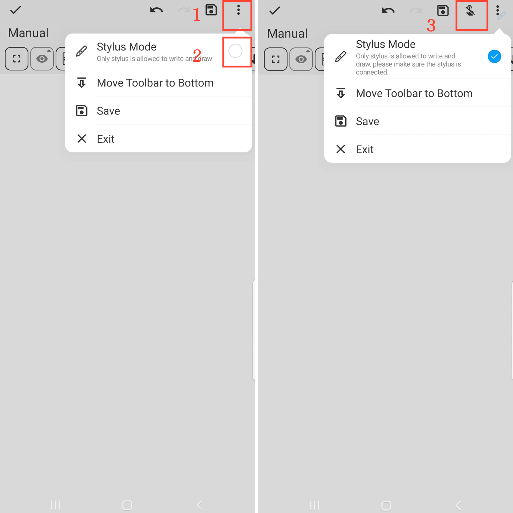

[Manual del Usuario](/dragonnest/drawnote/manual/es) > [Preguntas Frecuentes](/dragonnest/drawnote/manual/es/q_a) >

¿Cómo puedo prevenir toques accidentales con los dedos?
---
En la página de Super Nota, haz clic en el botón "⋮" Más en la esquina superior derecha de la pantalla y habilita el Modo Lápiz.

Una vez en el Modo Lápiz, aparecerá un botón "Desactivar Toque con el Dedo" en la parte superior de la página. Puedes hacer clic en este botón para prevenir toques accidentales con los dedos.

