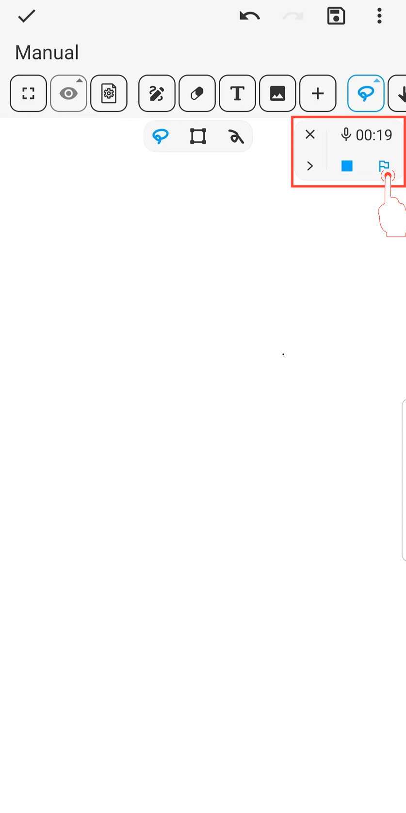

[Manual del usuario](/dragonnest/drawnote/manual/es) > [Super Nota](/dragonnest/drawnote/manual/es/super_note) >

Marcador de Audio
---
El marcador de audio es similar a un marcador de página, lo que te ayuda a ubicar rápidamente y reproducir secciones clave durante la grabación o reproducción de audio.

#### Pasos

Durante la grabación o reproducción, haz clic en el botón "Marcador" para insertar un marcador en el tiempo actual.

#### Consejos

1. **Ajustar la velocidad de audio y agregar marcadores** - Se hace fácilmente en la barra de herramientas.

2. **Editar nombres de grabación y marcadores** - Haz clic en el botón "≡" en la derecha, luego haz clic en el botón "Lápiz".

3. **Descargar audio** - Haz clic en el botón "⋮" en la izquierda para descargar.

4. **Ver historial de marcadores de audio** - Ver marcadores en el menú expandido; haz clic en un marcador para saltar rápidamente y reproducir el audio.

