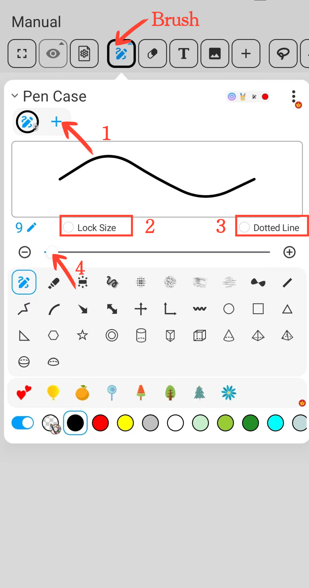
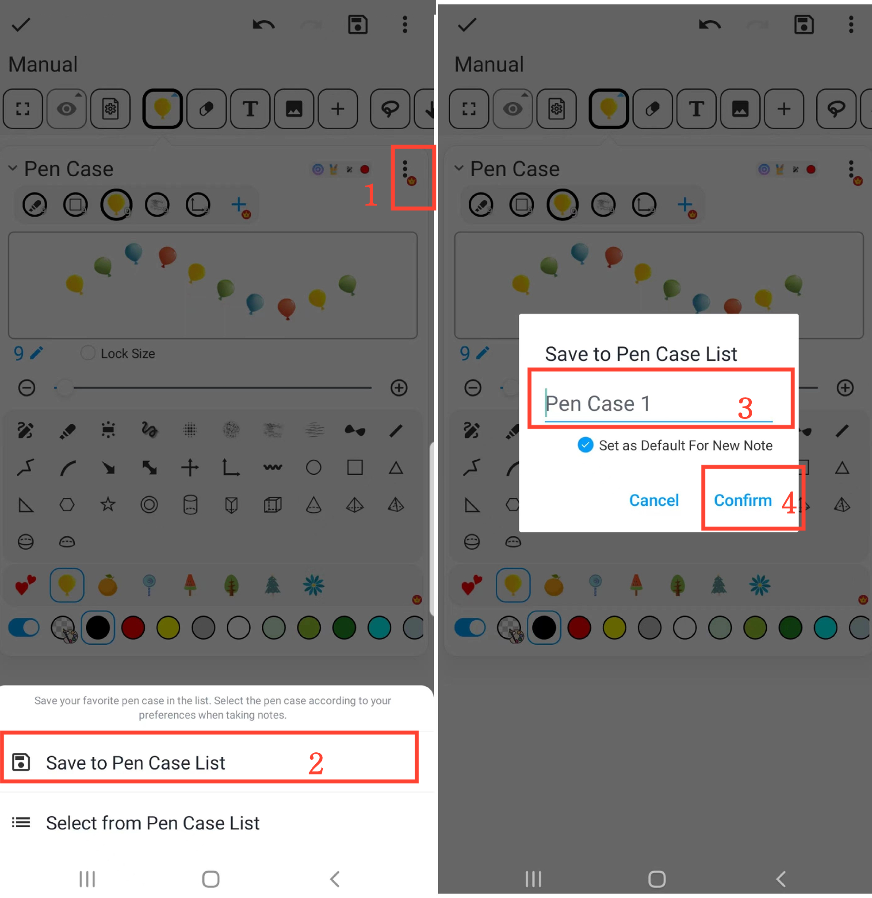

[Manual del usuario](/dragonnest/drawnote/manual/es) > [Súper Nota](/dragonnest/drawnote/manual/es/super_note) >

Función de Pincel
---

#### Pasos

Haz clic en el botón "Pincel" en la barra de herramientas para realizar las siguientes acciones.

#### 1. Recoger Pinceles

Haz clic en el botón "+" en la barra de colección de pinceles para añadir diferentes tipos de pinceles.

#### 2. Bloquear Tamaño del Pincel

Marca el botón "Bloquear Tamaño" para fijar el tamaño del pincel. Incluso si amplías o reduces el lienzo o la página, el tamaño del pincel permanecerá sin cambios.

#### 3. Efecto de Línea Discontinua

Marca el botón "Línea Discontinua" para aplicar el efecto de pincel de línea discontinua.

#### 4. Ajustar Tamaño del Pincel

Utiliza el deslizador central o los botones "+" y "-" en ambos lados para ajustar el tamaño del trazo del pincel.

#### 5. Ajustar Posición del Pincel

En la barra de pinceles, mantén presionado el pincel que deseas ajustar, luego arrástralo hacia la izquierda o derecha hasta la posición deseada y suelta.

#### 6. Eliminar Pinceles Recogidos

En la barra de pinceles, mantén presionado el pincel que deseas eliminar, luego arrástralo al icono de "Papelera" y suelta para eliminar ese pincel.

#### Guardar Estuche de Bolígrafos Común
En la página de pinceles, haz clic en el botón "⋮" en la esquina superior derecha y elige "Guardar en Lista de Pinceles". Luego, nombra tu conjunto de pinceles y confirma para guardar tu conjunto de pinceles comúnmente utilizado.

#### Elegir Estuche de Bolígrafos Común
En la página de pinceles, haz clic en el botón "⋮" en la esquina superior derecha, luego selecciona el conjunto de pinceles que necesitas de la lista de pinceles.

