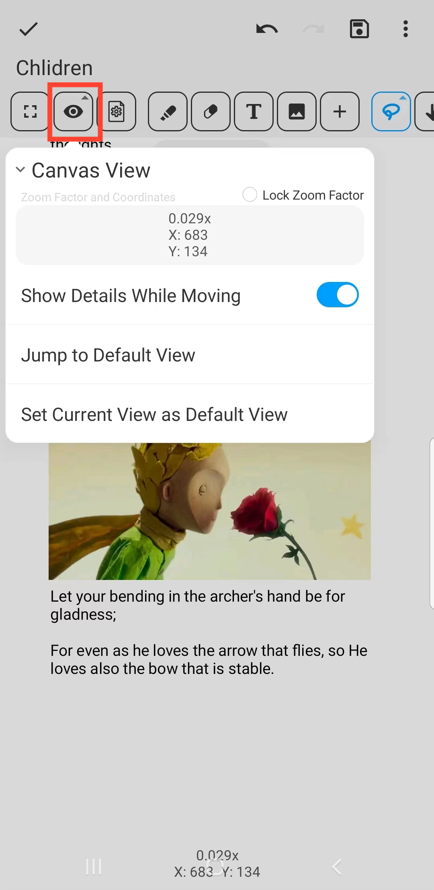

[Manual del usuario](/dragonnest/drawnote/manual/es) > [Súper Nota](/dragonnest/drawnote/manual/es/super_note) >

Vista del Lienzo
---
La vista del lienzo es la interfaz para ver y editar notas, que contiene información de coordenadas y zoom.

- Para facilitar la navegación en páginas grandes o con mucho contenido, puedes establecer una vista predeterminada.

- Haz clic en el botón "Ir a Vista Predeterminada" para volver rápidamente a la posición de vista predeterminada establecida.

#### Bloquear Relación de Zoom
Después de marcar "Bloquear Relación de Zoom", el lienzo mantendrá su nivel de zoom actual, evitando el zoom basado en gestos.