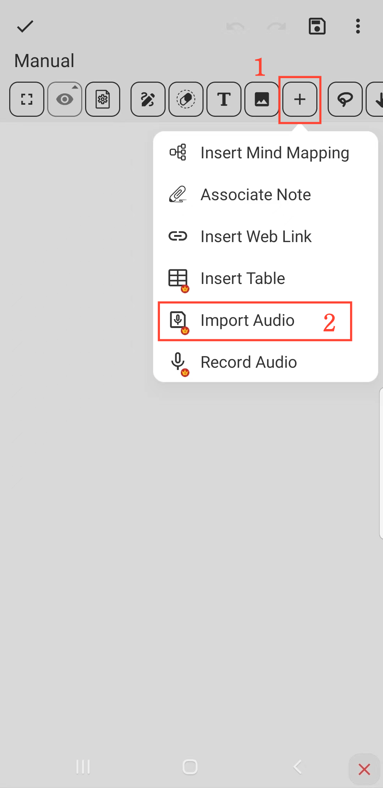

[Manual del usuario](/dragonnest/drawnote/manual/es) > [Super Nota](/dragonnest/drawnote/manual/es/super_note) >

Importar Audio
---
#### Pasos

1. Haz clic en el botón "+" en la barra de herramientas.

2. Elige la opción "Importar Audio". Selecciona el archivo de audio que deseas importar y listo.

