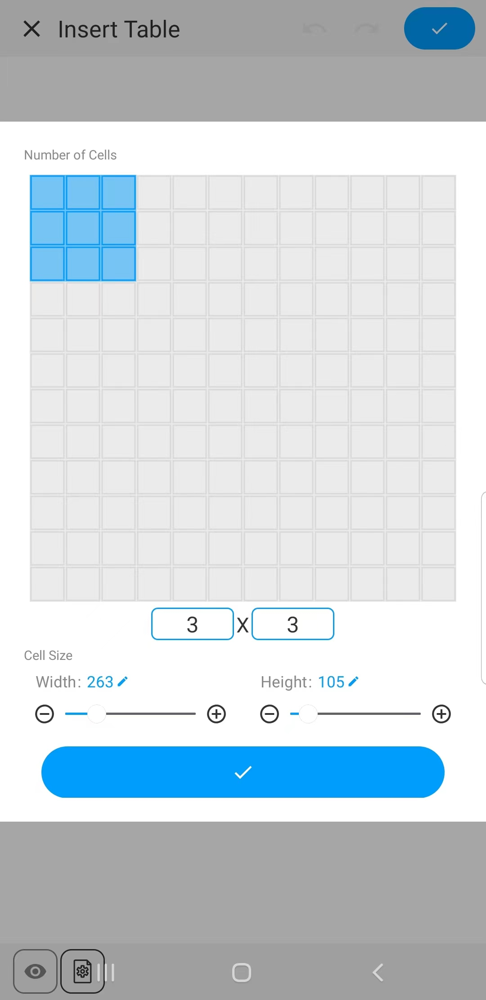

[Manual del Usuario](/dragonnest/drawnote/manual/es) > [Súper Nota](/dragonnest/drawnote/manual/es/super_note) >

Insertar Tabla
---
#### Pasos

1. Haz clic en el botón "+" en la barra de herramientas.

2. Elige "Insertar Tabla" para añadir una tabla a tus notas.

#### Consejos
- Configurar el número de celdas - Desliza o introduce números para elegir el número de celdas requerido.

- Ajustar el ancho y alto de la tabla - Desliza el control deslizante de tamaño o introduce números para establecer el tamaño predeterminado de la celda.

- Editar el formato de las celdas - Una vez seleccionada una celda, puedes establecer su tamaño, color y borrar su contenido.

- Editar el formato del texto en las celdas - Una vez seleccionada una celda, puedes editar su contenido de texto y formato, incluyendo color, tamaño de fuente, negrita, subrayado y alineación.

- Configurar el formato para toda una fila o columna - Una vez seleccionada una fila o columna, puedes combinar celdas, establecer el color de fondo, borrar contenido y más.

- Insertar toda una fila o columna - Una vez seleccionada una fila o columna, haz clic en el botón "Insertar" para añadir una nueva fila o columna.

- Configurar apariencia de la tabla - Haz clic en el botón "Configuración" en la parte inferior izquierda del lienzo, y en el menú, establece el color de fondo y de borde de la tabla.

