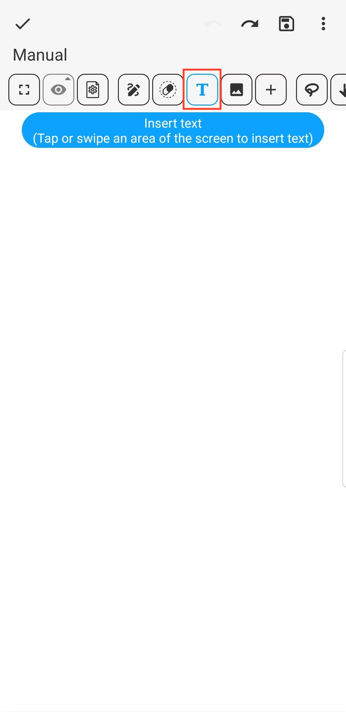
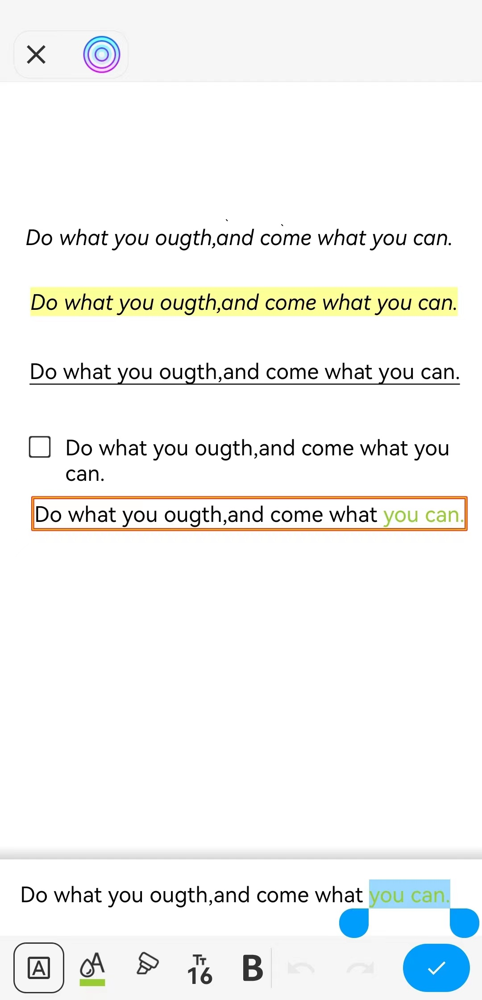

[Manual del Usuario](/dragonnest/drawnote/manual/es) > [Súper Nota](/dragonnest/drawnote/manual/es/super_note) >

Insertar Texto
---
#### Pasos

1. Haz clic en el botón "T" en la barra de herramientas.

2. Toca o desliza un área de la pantalla para insertar texto.

#### Consejos
- Una vez seleccionado el cuadro de texto, puedes Rotar, Alinear, Editar y más. Al hacer clic en "Más", también puedes crear una copia, cortar al portapapeles, bloquear y más.

  

- En el cuadro de edición de texto, una vez seleccionado el texto, puedes establecer su formato, incluyendo color, tamaño, negrita, subrayado y más.

