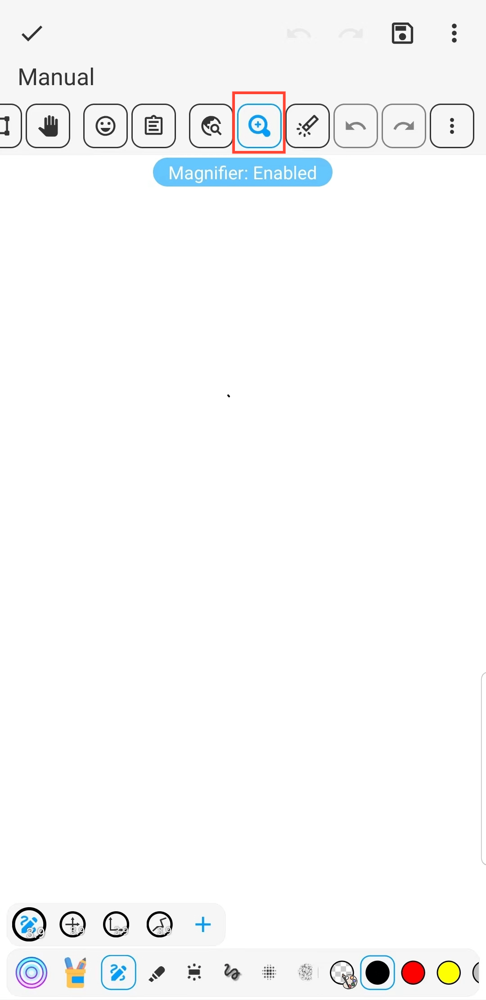

[Manual del Usuario](/dragonnest/drawnote/manual/es) > [Súper Nota](/dragonnest/drawnote/manual/es/super_note) >

Lupa
---
La función de lupa puede ayudarte a ver y editar el contenido de las notas de manera más conveniente. Especialmente cuando trabajas con fuentes pequeñas o gráficos detallados. Puede ampliar texto e imágenes y proporcionar posicionamiento preciso y operación conveniente.
#### Pasos

En la página de Súper Notas, haz clic en el botón de la lupa en la barra de herramientas.

