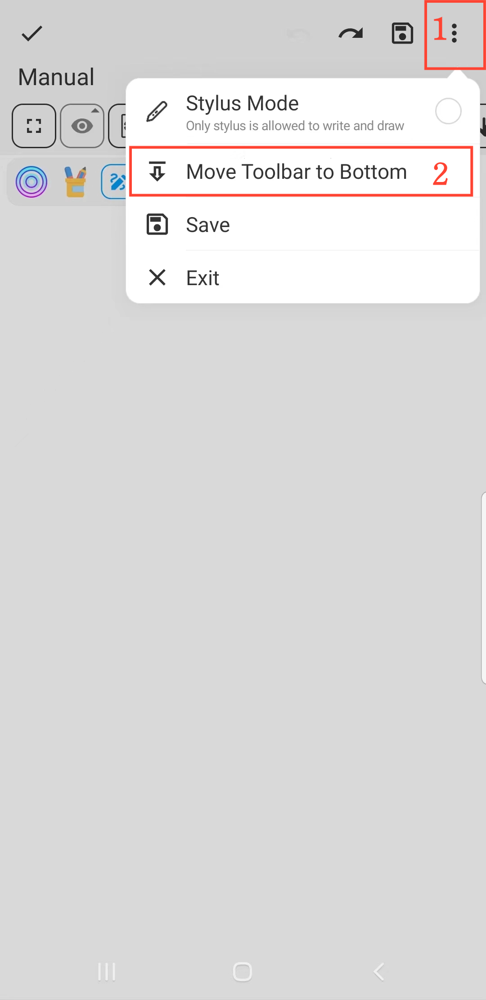

[Manual del Usuario](/dragonnest/drawnote/manual/es) > [Super Nota](/dragonnest/drawnote/manual/es/super_note) >

Mover Barra de Herramientas
---
#### Pasos

1. Haz clic en el botón "⋮" en la esquina superior derecha del lienzo.

2. Elige la posición de la barra de herramientas: "Mover Barra de Herramientas Abajo" o "Mover  Barra de Herramientas Arriba".

