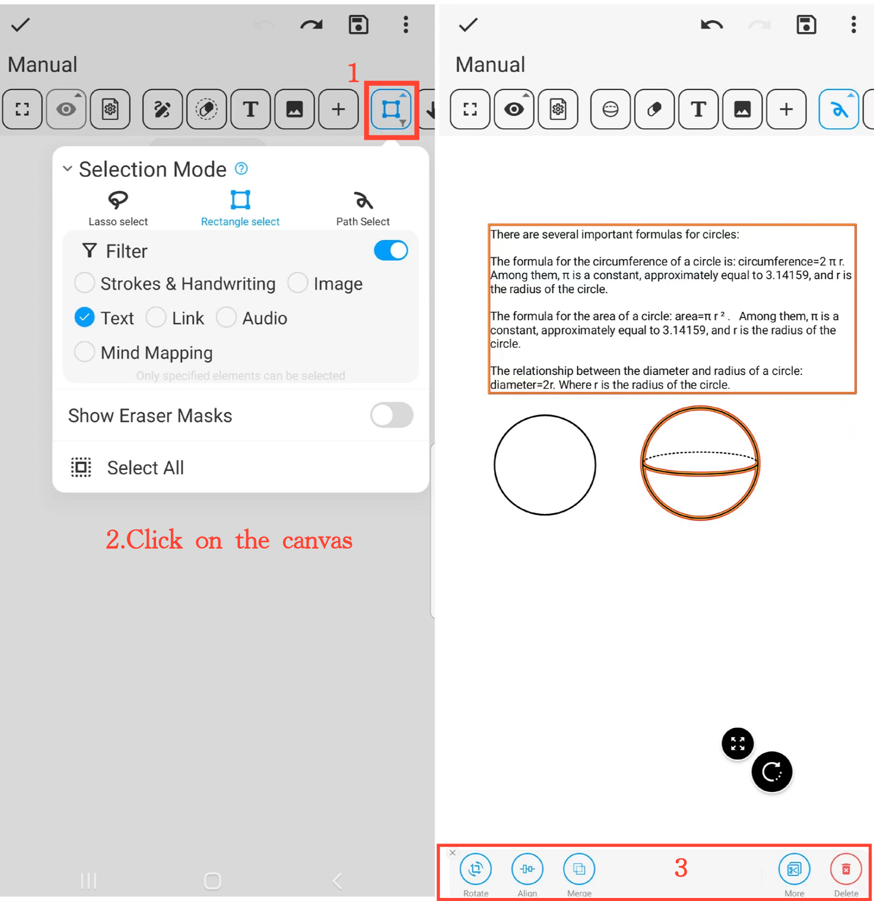

[Manual del Usuario](/dragonnest/drawnote/manual/es) > [Super Nota](/dragonnest/drawnote/manual/es/super_note) >

Modo de Selección
---

El modo de selección proporciona varias herramientas de selección:

- Selección de lazo - Selecciona elementos dentro del área cerrada formada por el lazo.

- Selección de rectángulo - Selecciona elementos dentro del área rectangular.

- Selección ruta - Selecciona elementos cubiertos por el camino.

#### Pasos

1. Haz clic en el botón "Modo de Selección" en la barra de herramientas y elige la herramienta de selección deseada.

2. Haz clic en el lienzo y desliza para seleccionar el contenido que deseas editar. Puede ser un elemento único o múltiples elementos.

3. Realiza acciones en los elementos seleccionados como rotar, ampliar, reducir, fusionar, cortar, eliminar y más.

#### Consejo
Cuando varios elementos se superponen, puedes activar el filtro para seleccionar específicamente el contenido deseado, mejorando la eficiencia de gestión y organización.