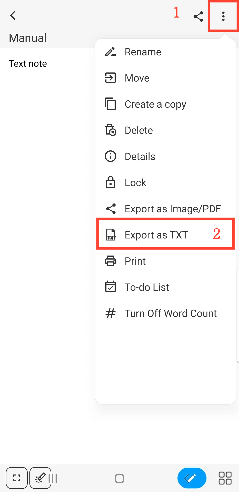

[Manual del Usuario](/dragonnest/drawnote/manual/es) > [Nota de Texto](/dragonnest/drawnote/manual/es/nota_de_texto) >

Exportar como TXT
---
#### Pasos

Mientras esté en el modo de lectura de la Nota de Texto, toque el botón "⋮" ubicado en la parte superior derecha de la pantalla y seleccione "Exportar como TXT".

