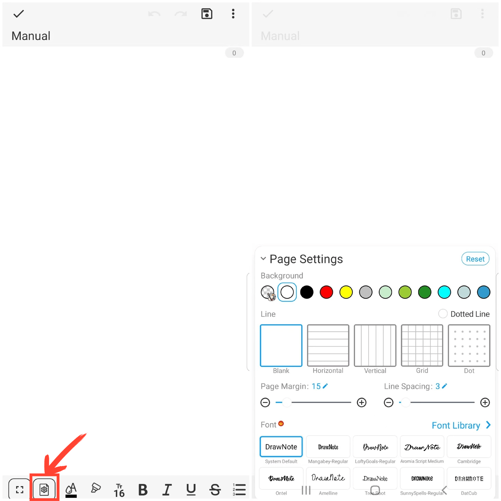

[Manual del Usuario](/dragonnest/drawnote/manual/es) > [Nota de Texto](/dragonnest/drawnote/manual/es/nota_de_texto) >

Configuración de Página
---
#### Pasos

Haz clic en el icono "Configuración de Página" ubicado en la barra de herramientas inferior de la pantalla para abrir el menú de configuración de página. Puedes definir el fondo de la página, el estilo de línea, el grosor de línea, los márgenes de la fuente, el espaciado entre líneas y el estilo de fuente, entre otros.

