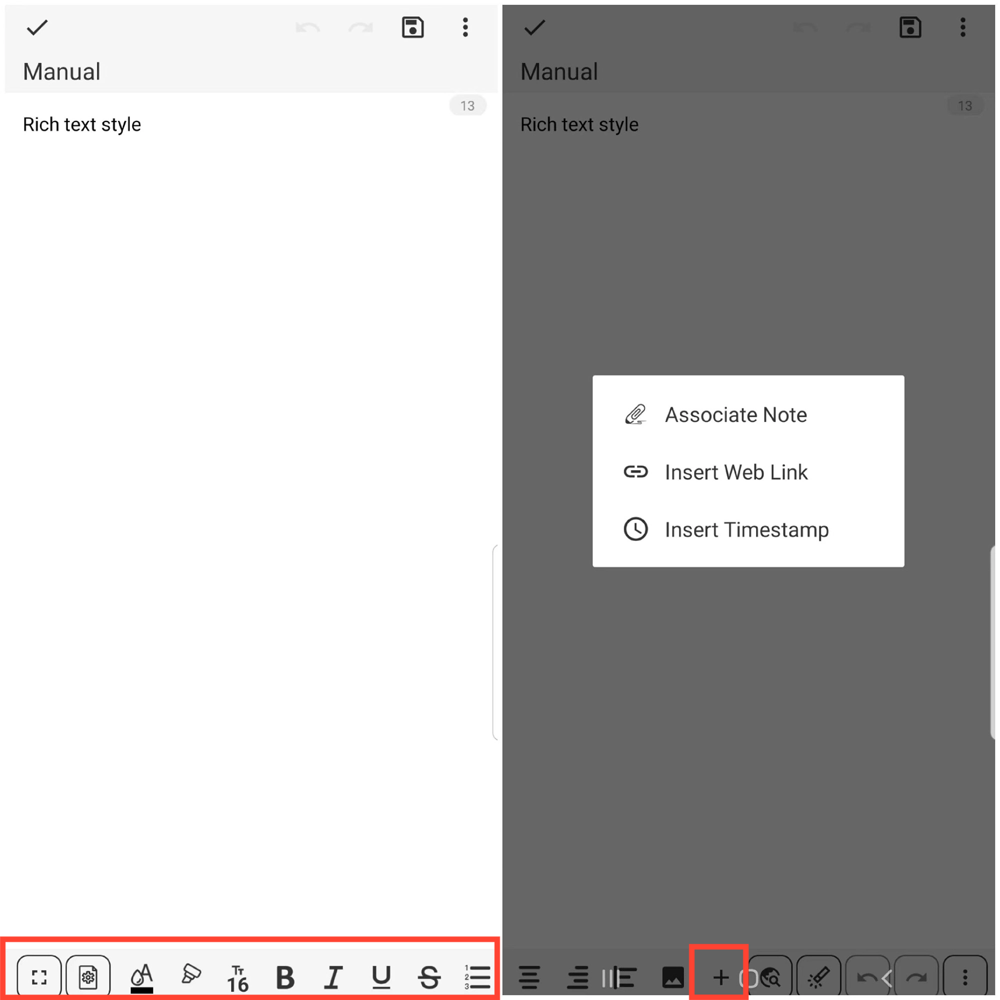

[Manual del Usuario](/dragonnest/drawnote/manual/es) > [Nota de Texto](/dragonnest/drawnote/manual/es/nota_de_texto) >

Estilo de Texto Enriquecido
---
La función de estilo de texto enriquecido de la Nota de Texto ofrece una experiencia de edición de texto más diversificada.

Además de grabar texto fácilmente, también puedes personalizar el color de la fuente, el tamaño, negrita, cursiva, subrayado y otros estilos.

Además, hemos introducido funciones de entrada rápida como la inserción de enlaces, la inserción de marcas de tiempo y la inserción de imágenes para mejorar tu eficiencia de edición.

