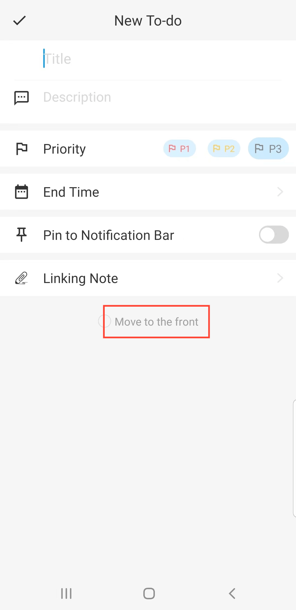

[Manual del usuario](/dragonnest/drawnote/manual/es) > [Tareas](/dragonnest/drawnote/manual/es/to_do) >

Crear un nuevo elemento de la lista de tareas pendientes
---
#### Pasos

1. Navega hasta la página de 'Tareas '.

2. Haz clic en el botón "+".

3. Ingresa detalles como el título, descripción y otra información relevante.

4. Toca el botón de confirmación en la parte superior izquierda para agregar un nuevo elemento a la lista de tareas pendientes.

#### Consejos
1. Contador de tareas pendientes - El número de tareas pendientes se muestra en la barra de pestañas inferior.

2. Fijar un elemento de la lista de tareas pendientes - En la página 'Lista de tareas pendientes', toca el botón "pin" en la esquina superior derecha de un elemento para mover las tareas importantes hacia arriba.

3. Mover al principio - En la pantalla de 'Nueva tarea pendiente', toca el botón "Mover al principio" en la parte inferior para colocar la tarea en la parte superior.

