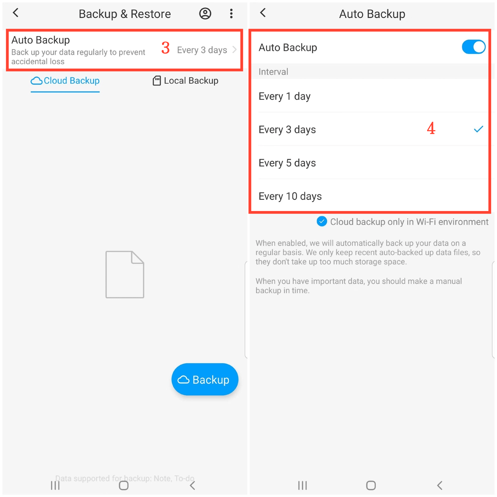

[Manuel de l'utilisateur](/dragonnest/drawnote/manual/fr) > [Sauvegarde et restauration des données](/dragonnest/drawnote/manual/fr/sauvegarde_et_restauration_des_données) >

Sauvegarde automatique
---
#### Étapes

1. Appuyez sur "Moi" sur la page principale.

2. Accédez à l'option "Sauvegarde & Restauration".

3. Sélectionnez l'option "Sauvegarde automatique".

4. Activez le commutateur "Sauvegarde automatique" et choisissez l'intervalle de sauvegarde. Pour protéger vos données et vous préparer à des circonstances imprévues.

