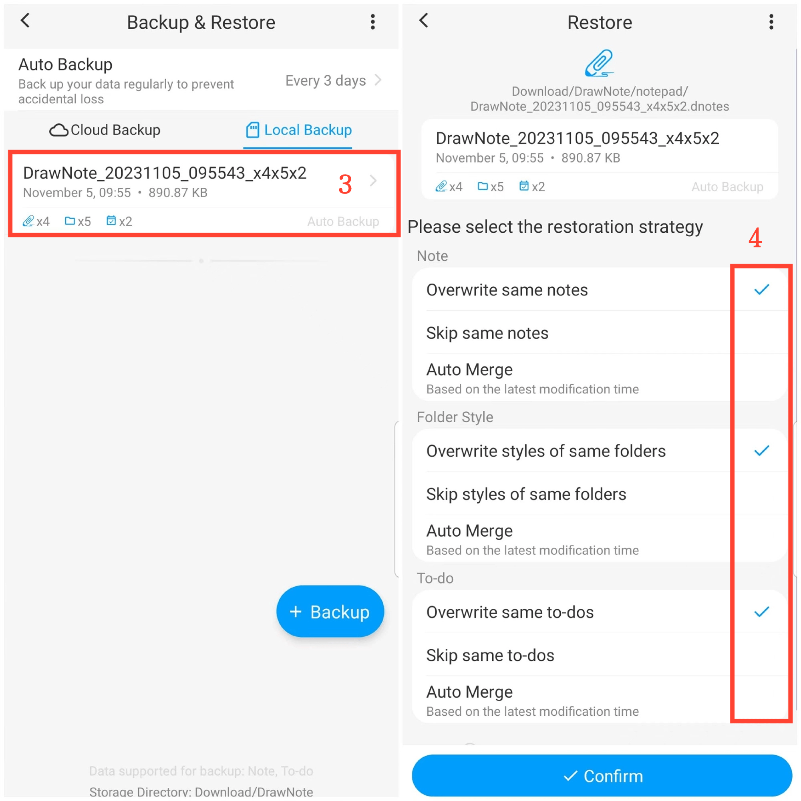

[Manuel de l'utilisateur](/dragonnest/drawnote/manual/fr) > [Sauvegarde et restauration des données](/dragonnest/drawnote/manual/fr/data_backup_and_recovery) >

restauration des données
---
#### Étapes

1. Appuyez sur "Moi" sur la page principale.

2. Accédez à l'option "Sauvegarde et restauration".

3. Cliquez sur une entrée de fichier pour sélectionner un fichier de sauvegarde.

4. Cochez les options appropriées.

5. Cliquez sur "Confirmer" pour restaurer les données.

#### Conseils
Lors de la restauration des données de sauvegarde, trois stratégies sont disponibles :

- Écraser les notes identiques - Remplacer les notes actuelles par le contenu de la sauvegarde.
- Ignorer les notes identiques - Conserver les notes actuelles inchangées lorsque le contenu de la sauvegarde est identique.
- Fusion automatique - Fusionner les notes de sauvegarde et existantes en fonction de la dernière heure de modification.

Choisissez la stratégie appropriée en fonction de vos besoins et sauvegardez régulièrement pour éviter la perte de données.