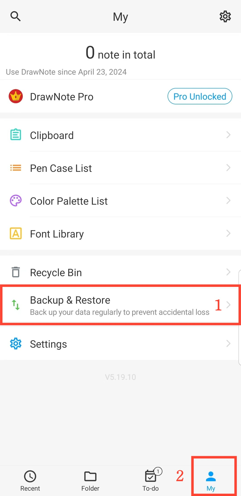

[Manuel de l'utilisateur](/dragonnest/drawnote/manual/fr) >

Sauvegarde et restauration des données
---

Avec la fonctionnalité de sauvegarde et de restauration des données, vous pouvez facilement protéger les informations critiques et éviter les pertes inattendues.
Vous pouvez choisir entre la "sauvegarde cloud" ou la "sauvegarde locale".
- [Sauvegarde des données](data_backup.md)

- [Sauvegarde automatique](automatic_backup.md)

- [restauration des données](data_recovery.md)

- [Gérer les données de sauvegarde](manage_backup_data.md)

