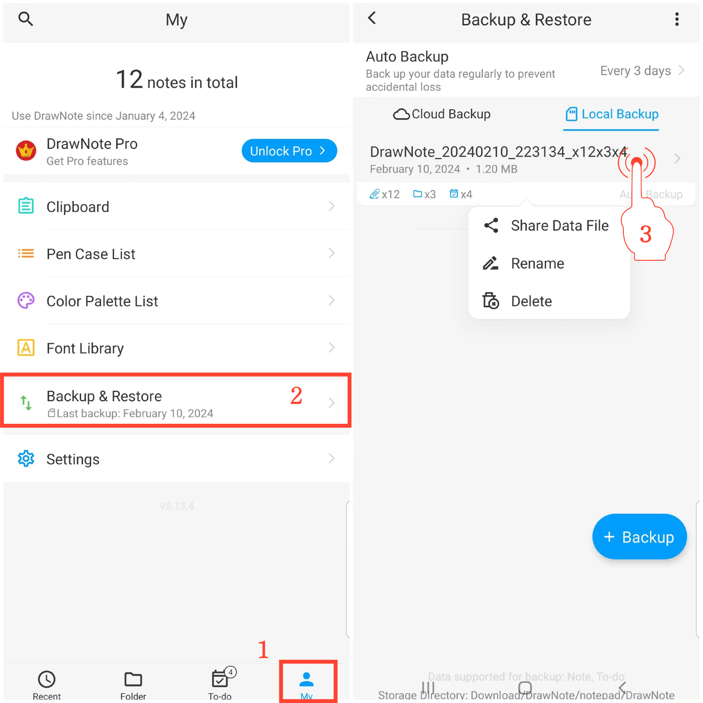

[Manuel de l'utilisateur](/dragonnest/drawnote/manual/fr) > [Sauvegarde et restauration des données](/dragonnest/drawnote/manual/fr/data_backup_and_recovery) >

Gérer les données de sauvegarde
---
#### Étapes

1. Appuyez sur "Moi" sur la page principale.

2. Accédez à l'option "Sauvegarde & Restauration".

3. Maintenez enfoncée une entrée de fichier pour gérer les éléments de restauration de données. Vous pouvez effectuer des opérations de partage, de renommage et de suppression.

