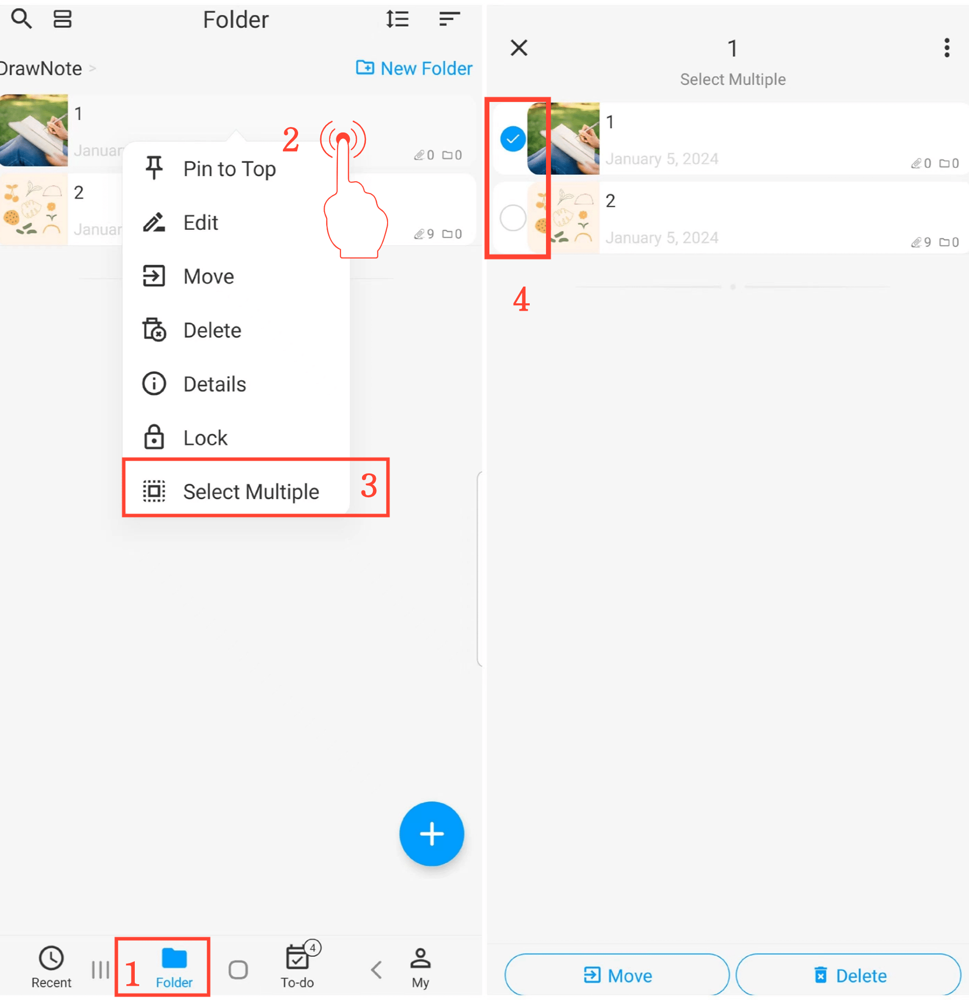

[Manuel de l'utilisateur](/dragonnest/drawnote/manual/fr) > [Dossier](/dragonnest/drawnote/manual/fr/folder) >

Sélectionner plusieurs dossiers ou notes
---

#### Étapes

1. Appuyez sur "Dossier" sur la page principale.
2. Maintenez enfoncé un dossier ou une note.
3. Appuyez sur "Sélectionner plusieurs" dans le menu contextuel pour entrer en mode de sélection multiple.
4. Sélectionnez les dossiers ou notes que vous souhaitez modifier, puis effectuez des actions en lot telles que le déplacement ou la suppression.

