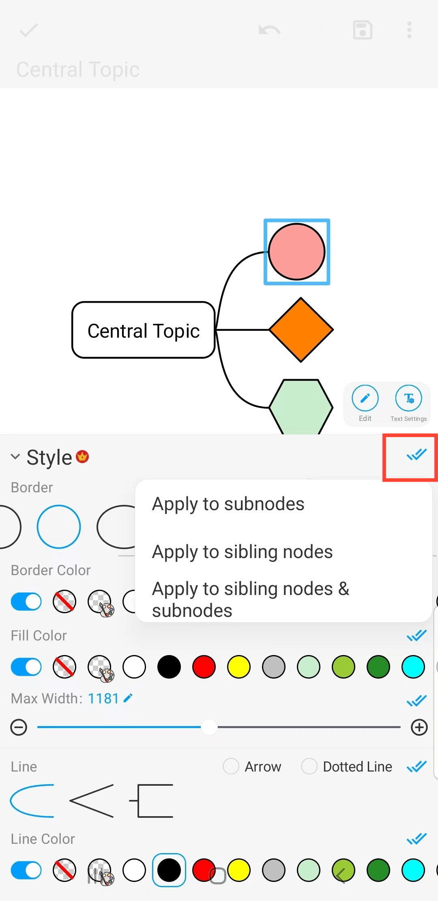

[Manuel de l'utilisateur](/dragonnest/drawnote/manual/fr) > [Carte mentale](/dragonnest/drawnote/manual/fr/mind_mapping) >

Contours et styles de ligne
---
#### Étapes

1. Cliquez sur le cadre du nœud que vous souhaitez définir.

2. Cliquez sur l'onglet "Style".

3. Dans la fenêtre contextuelle, choisissez les options de style souhaitées, telles que la forme du contour, la couleur du contour, la couleur de remplissage, le style de ligne et la couleur de ligne.

#### Conseils
Cliquez sur les double coches bleues à droite. Pour appliquer le style aux sous-nœuds, aux nœuds frères ou aux deux.

