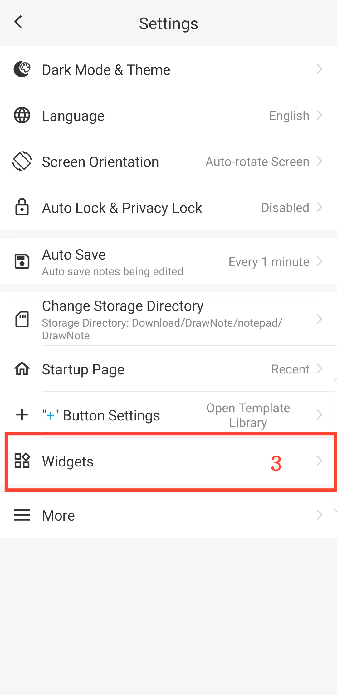

[Manuel de l'utilisateur](/dragonnest/drawnote/manual/fr) > [Plus](/dragonnest/drawnote/manual/fr/more) >

Ajouter un widget sur le bureau
---
En ajoutant des widgets sur le bureau de votre appareil, vous pouvez accéder facilement et rapidement aux fonctions d'édition de notes sans ouvrir l'application.

### Étapes opérationnelles

1. Appuyez sur "Moi" sur l'écran principal.
2. Accédez aux "paramètres".
3. Cliquez sur "Widgets" et sélectionnez le type de widget que vous souhaitez ajouter.

#### Conseils
Vous pouvez également accéder directement aux paramètres du widget sur l'écran d'accueil de votre appareil, trouver l'application, puis ajouter le widget sur le bureau.