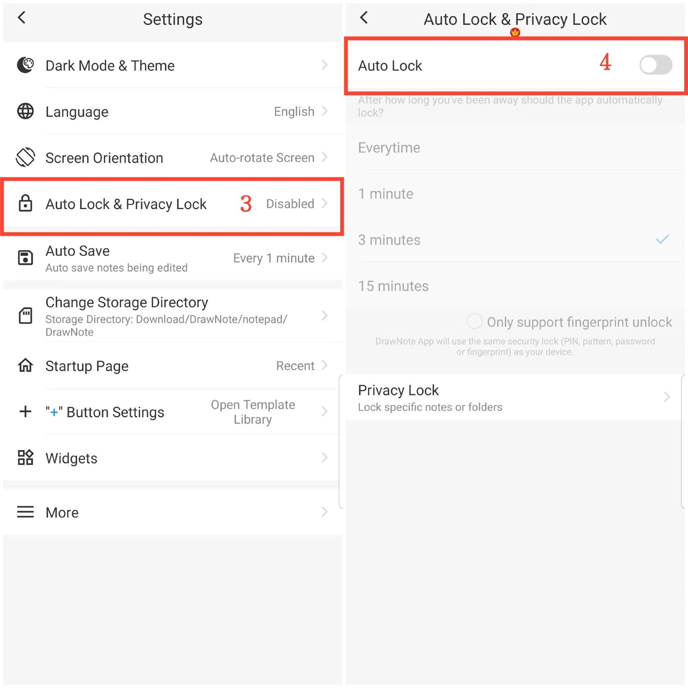

[Manuel de l'utilisateur](/dragonnest/drawnote/manual/fr) > [Plus](/dragonnest/drawnote/manual/fr/more) >

Verrouillage automatique
---
Le verrouillage automatique fait référence au verrouillage automatique de l'application après une période d'inactivité. Pour améliorer la confidentialité et la sécurité des données, empêcher l'accès non autorisé.

#### Étapes

1. Appuyez sur "Moi" sur la page principale.

2. Accédez aux paramètres.

3. Cliquez sur "Verrouillage automatique & Verrouillage de la confidentialité".

4. Activez le commutateur "Verrouillage automatique" et sélectionnez le délai de verrouillage automatique.

