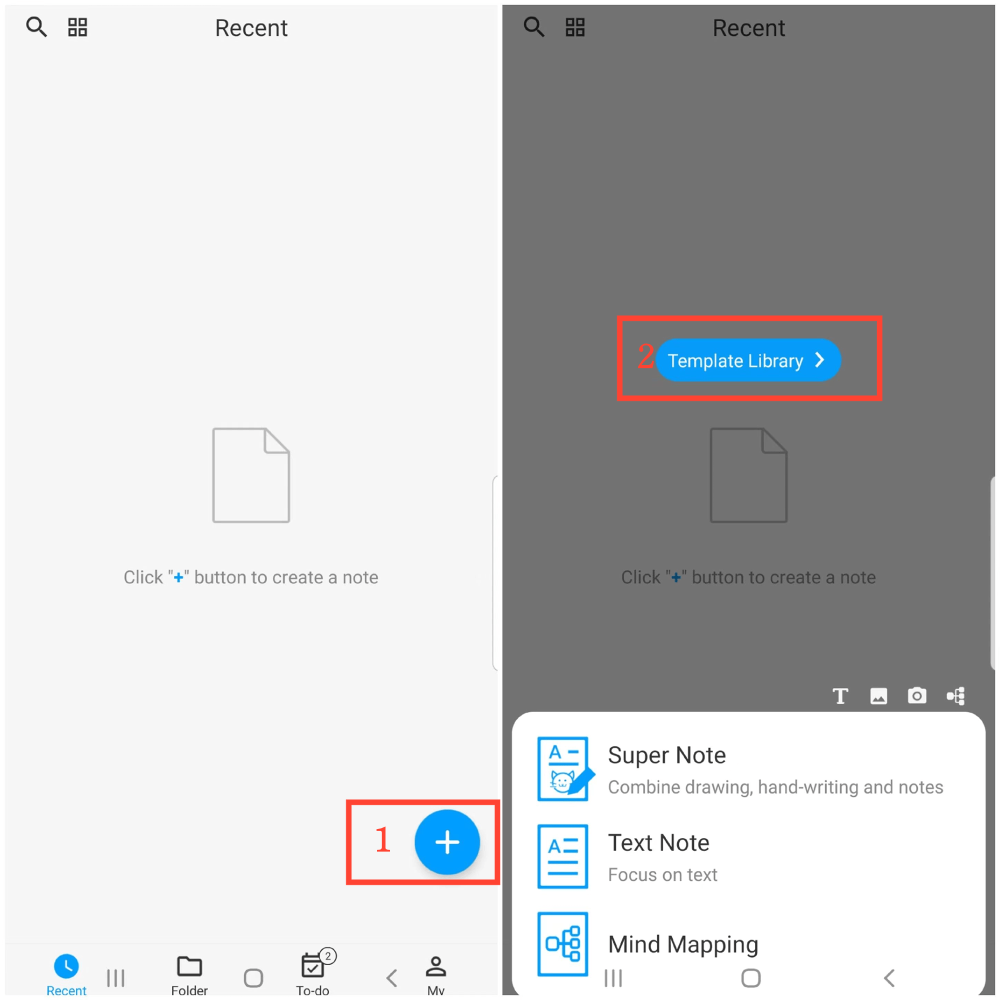
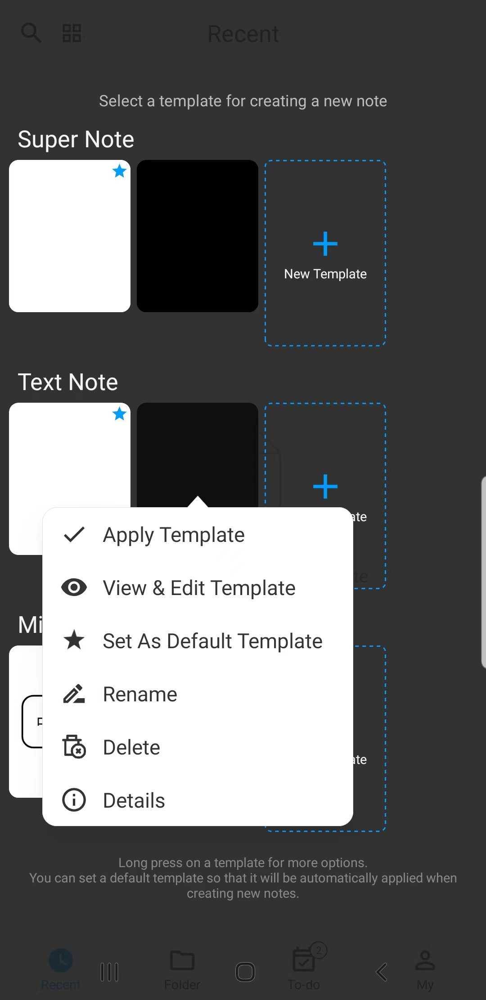

[Manuel de l'utilisateur](/dragonnest/drawnote/manual/fr) > [Plus](/dragonnest/drawnote/manual/fr/more) >

Création de modèles
---
En créant des modèles, vous pouvez appliquer automatiquement la configuration du modèle lors de la création d'une nouvelle note, telle que la couleur de fond, la taille de la police, la couleur de la police et d'autres paramètres courants.

### Étapes
1. Sur la page d'accueil de l'application, appuyez sur l'icône "+" dans le coin inférieur droit.
2. Appuyez sur "Bibliothèque de modèles".
3. Sélectionnez "Nouveau modèle" après le type de note souhaité.
4. Accédez à la page d'édition du modèle pour configurer les paramètres, y compris la couleur de fond, la taille de la police, la couleur de la police, etc., et enregistrez lorsque vous avez terminé.

#### Conseils
Maintenez enfoncé sur la bibliothèque de modèles pour accéder à plus d'options, telles que Voir et éditer le modèle, Définir comme modèle par défaut, etc.
