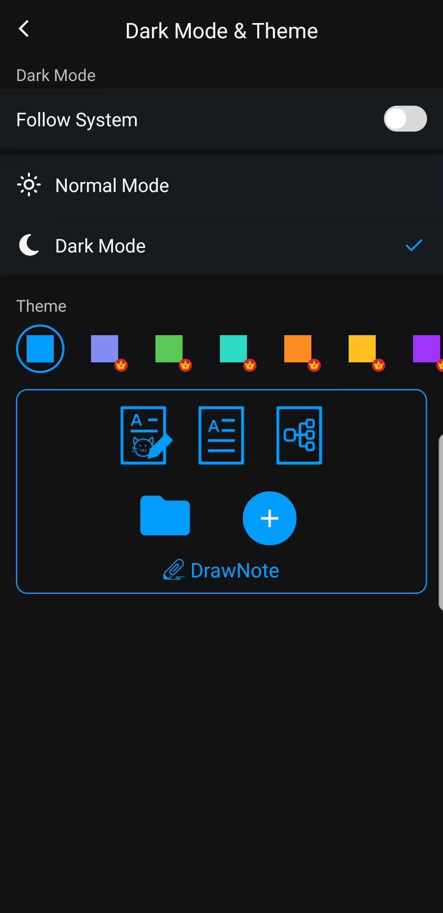

[Manuel de l'utilisateur](/dragonnest/drawnote/manual/fr) > [Plus](/dragonnest/drawnote/manual/en/more) >

Mode sombre et changement de thème
---
Le mode sombre offre une expérience de lecture plus confortable, aidant à réduire la fatigue oculaire et à protéger la santé visuelle. Cette fonctionnalité vous permet de passer facilement à un mode sombre plus confortable et de choisir des couleurs de thème selon vos préférences personnelles.

### Étapes opérationnelles
1. Appuyez sur "Moi" sur l'écran principal.
2. Accédez aux paramètres.
3. Cliquez sur "Mode sombre & Thème".
4. Ici, vous pouvez passer en mode sombre et choisir différentes couleurs de thème pour personnaliser l'interface selon vos préférences.

