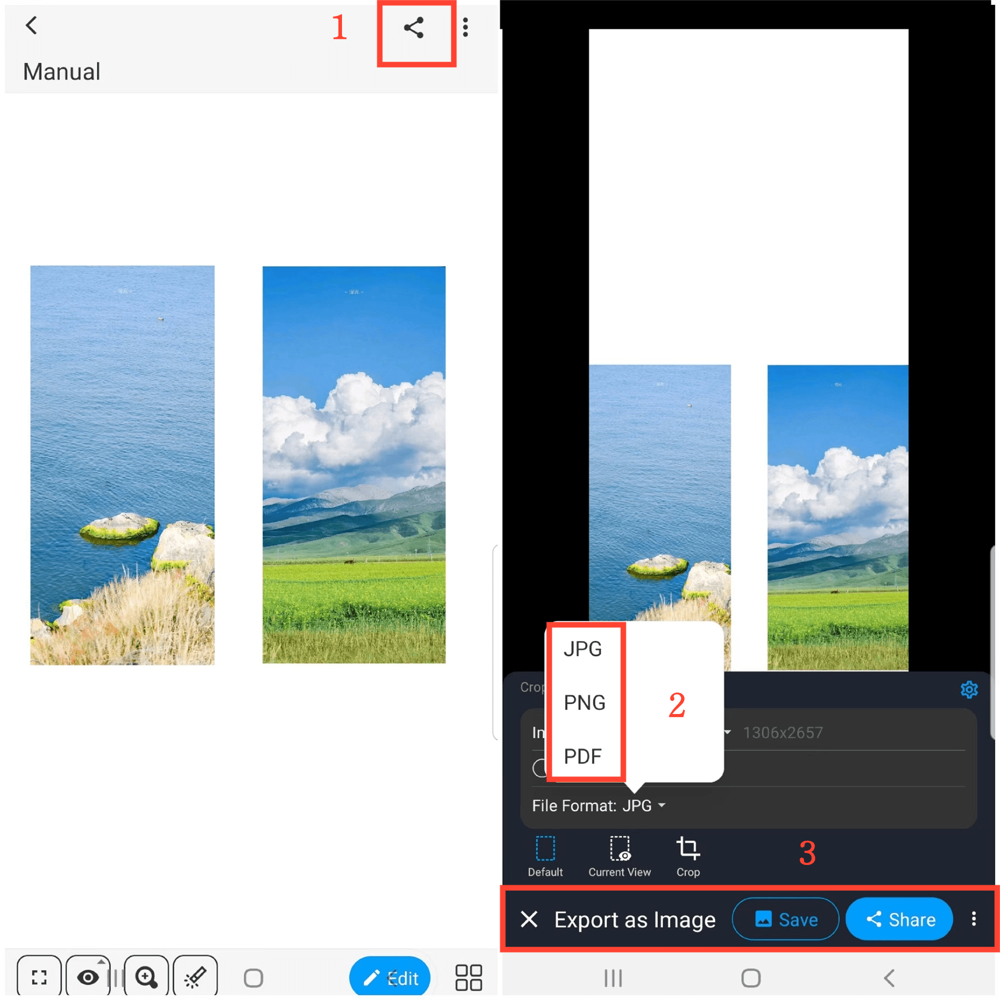

[Manuel de l'utilisateur](/dragonnest/drawnote/manual/fr) > [Plus](/dragonnest/drawnote/manual/fr/more) >

Exporter/Partager les notes
---
Il existe deux méthodes pour exporter/partager des notes.

#### Méthode 1
1. En mode lecture, cliquez sur l'icône "Partager" dans le coin supérieur droit du canevas.

2. Choisissez le format de fichier dans lequel vous souhaitez exporter votre note.

3. Sélectionnez "Enregistrer" ou "Partager" et choisissez la méthode de partage pour finaliser l'action.

#### Méthode 2
1. En mode lecture, cliquez sur l'icône "⋮" plus dans le coin supérieur droit.

2. Sélectionnez "Exporter en tant qu'image/PDF".

3. Choisissez le format de fichier dans lequel vous souhaitez exporter votre note.

4. Cliquez sur "Enregistrer" ou "Partager" et choisissez la méthode de partage pour finaliser l'action.

