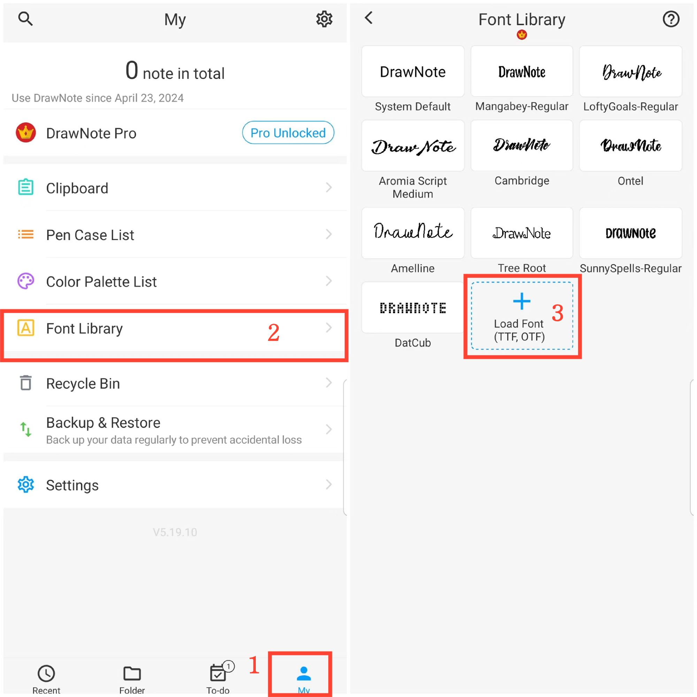

[Manuel de l'utilisateur](/dragonnest/drawnote/manual/fr) > [Plus](/dragonnest/drawnote/manual/fr/more) >

Bibliothèque de polices
---
La bibliothèque de polices peut enregistrer vos polices couramment utilisées. Elle vous permet de choisir librement le style de police approprié dans les notes textuelles ou les zones de texte.

#### Étapes

1. Appuyez sur "Moi" sur la page principale.

2. Accédez à la bibliothèque de polices.

3. Cliquez sur "Charger la police" et sélectionnez un fichier de police à importer.

#### Conseils
Vous pouvez télécharger les polices que vous souhaitez à partir de ce site web : https://www.fontspace.com/commercial-fonts