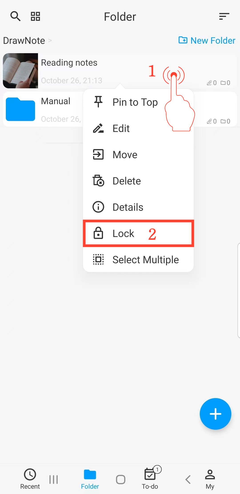

[Manuel de l'utilisateur](/dragonnest/drawnote/manual/fr) > [Plus](/dragonnest/drawnote/manual/en/more) >

Verrouillage de la confidentialité
---
Avec le Verrouillage de la confidentialité, vous pouvez verrouiller des notes et des dossiers spécifiques.

#### Étapes

1. Maintenez enfoncée la note ou le dossier que vous souhaitez verrouiller/déverrouiller.

2. Dans le menu contextuel, cliquez sur "Verrouiller"/"Déverrouiller" pour verrouiller ou déverrouiller la note ou le dossier.

#### Conseils
- Le contenu verrouillé ne peut pas être recherché directement.

- Dans l'interface "Moi" et "Verrouillage automatique et verrouillage de la confidentialité", vous pouvez configurer le Verrouillage de la confidentialité avec déverrouillage par empreinte digitale ou mot de passe.

- Le Verrouillage de la confidentialité est un mécanisme de verrouillage temporaire local. Cela signifie que lorsque vous verrouillez des notes, les sauvegardez, puis restaurez ces notes sur un autre appareil, vous n'avez pas besoin de les déverrouiller à nouveau pour voir leur contenu.