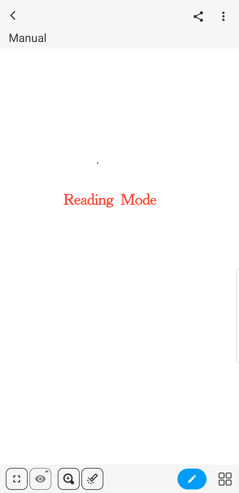
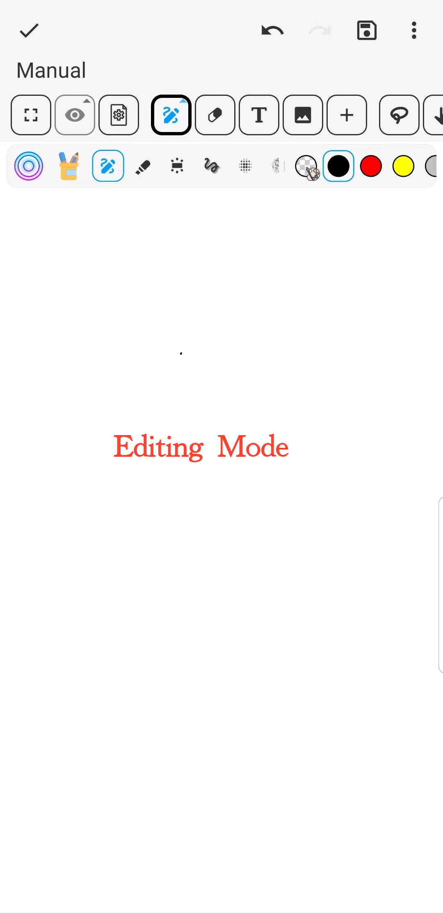

[Manuel de l'utilisateur](/dragonnest/drawnote/manual/fr) > [Plus](/dragonnest/drawnote/manual/en/more) >

Mode Lecture et Mode Édition
---
Le mode Lecture et le mode Édition sont deux états des notes utilisés pour visualiser et modifier le contenu des notes.

#### Mode Lecture
- Sélectionnez la note que vous souhaitez consulter et cliquez pour entrer en mode lecture.

- Si vous êtes actuellement en train de modifier une note, cliquez sur l'icône "√" dans le coin supérieur gauche pour basculer en mode lecture.

#### Mode Édition
- Si vous êtes actuellement en train de lire une note, cliquez sur l'icône "Étui à stylos" dans le coin inférieur droit pour passer en mode édition et modifier la note.

En mode lecture, vous pouvez :

- Visualiser le contenu de la note et effectuer un zoom avant ou arrière pour obtenir des informations.

- Accéder à des notes connexes pour plus d'informations.

- Cliquer sur l'icône de lien web pour naviguer vers la page web associée.

- Visualiser, enregistrer ou partager des images dans la note.

- Cliquer sur l'icône "⋮" dans le coin supérieur droit pour accéder à des options telles que le renommage, le déplacement, la suppression, l'exportation, etc.

- Cliquer sur la barre d'outils en bas pour basculer la vue par défaut, marquer, effectuer un zoom, changer de note, créer des dossiers et effectuer d'autres opérations.