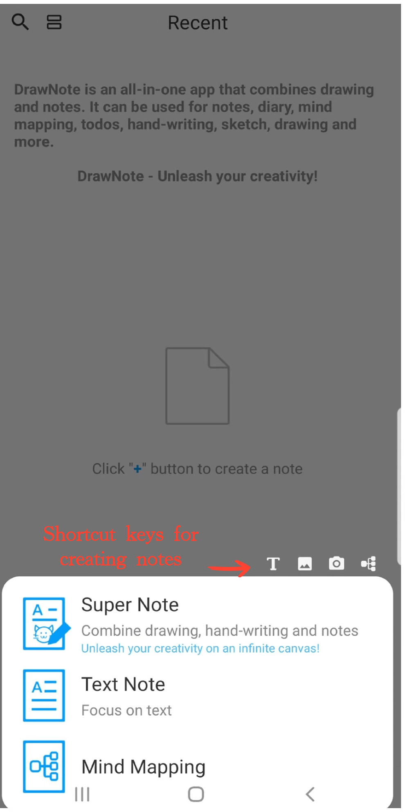

### Créer une nouvelle note

DrawNote propose une variété de types de notes flexibles pour répondre à différents scénarios d'utilisation, notamment la Super Note, la Note de Texte et la Cartographie Mentale.

- Super Note - Une note complète qui combine l'écriture manuscrite, le dessin, le texte, les images, les enregistrements audio, les tableaux et les cartes mentales. Elle vous permet d'exprimer pleinement votre créativité et votre talent artistique sur un canevas flexible.

- Note Texte - Axée sur l'enregistrement de texte et prenant en charge les paramètres de texte enrichi ainsi que l'insertion d'images, rendant vos notes plus diversifiées et visuelles.

- Carte Mentale - Vous aide à capturer rapidement des idées et à organiser vos connaissances, présentant des concepts complexes dans une structure graphique claire.

#### Étapes

Sur la page d'accueil de l'application, appuyez sur l'icône "+" dans le coin inférieur droit. Ensuite, sélectionnez le type de note que vous souhaitez créer pour démarrer votre note.

#### Conseils

- Lorsque vous appuyez sur le bouton "+" dans la section 'Dossier' pour créer une nouvelle note, la note sera automatiquement catégorisée sous le dossier actuel.

- Vous pouvez également utiliser les raccourcis en haut du menu pour accéder rapidement aux différentes interfaces de création dans la Super Note.

