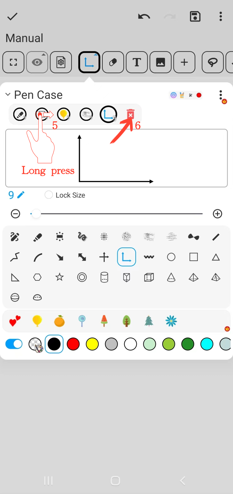
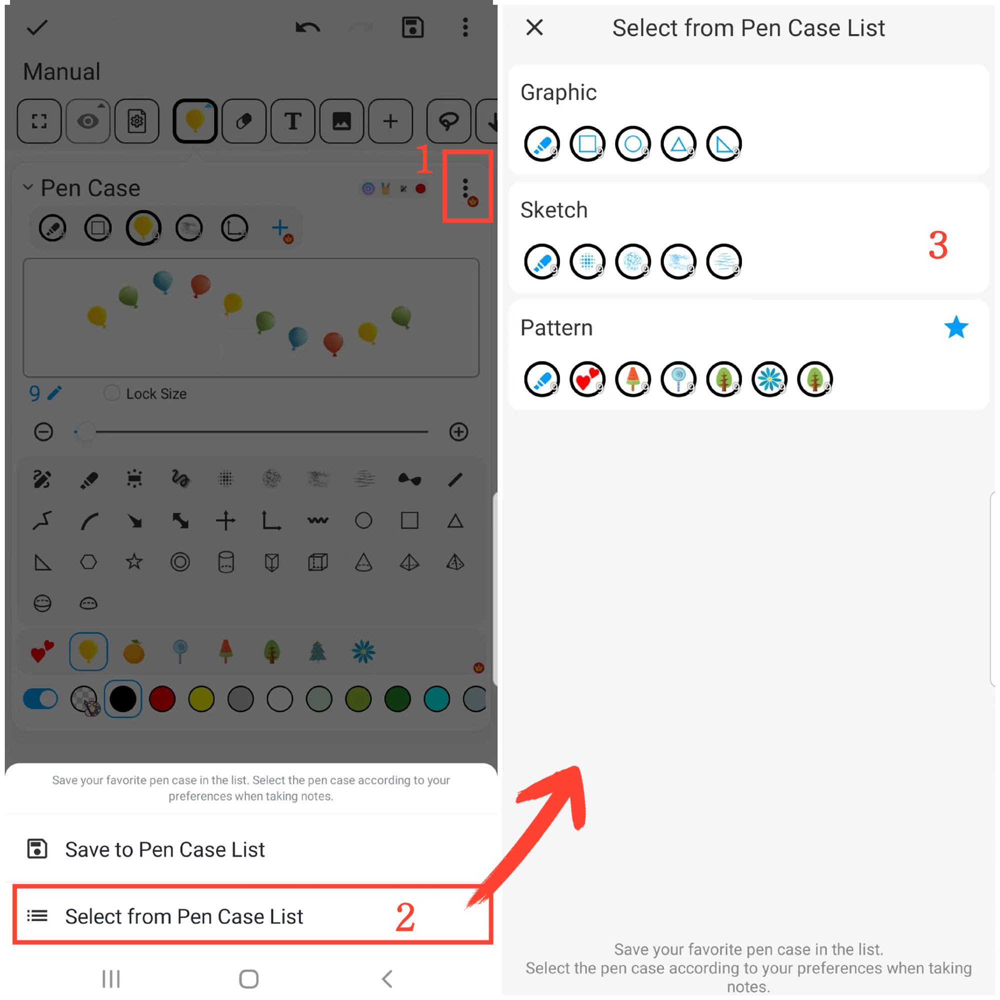

[Manuel de l'utilisateur](/dragonnest/drawnote/manual/fr) > [Super Note](/dragonnest/drawnote/manual/fr/super_note) >

Fonction Étui à stylos
---

#### Étapes

Cliquez sur le bouton "Étui à stylos" dans la barre d'outils pour effectuer les actions suivantes.

#### 1. Collecter des Brosses

Cliquez sur le bouton "+" dans la barre de collection de brosses pour ajouter différents types de brosses.

#### 2. Verrouiller la Taille de la Brosse

Cochez le bouton "Verrouiller la Taille" pour fixer la taille de la brosse. Même si vous zoomez sur le canevas ou la page, la taille de la brosse restera inchangée.

#### 3. Effet de Ligne Pointillée

Cochez le bouton "Ligne Pointillée" pour appliquer l'effet de brosse en ligne pointillée.

#### 4. Ajuster la Taille de la Brosse

Utilisez le curseur central ou les boutons "+" et "-" des deux côtés pour ajuster la taille du trait de la brosse.

#### 5. Ajuster la Position de la Brosse

Dans la barre de brosses, appuyez et maintenez enfoncée la brosse que vous souhaitez ajuster, puis faites-la glisser vers la gauche ou vers la droite jusqu'à la position désirée et relâchez-la.

#### 6. Supprimer les Brosses Collectées

Dans la barre de brosses, appuyez et maintenez enfoncée la brosse que vous souhaitez supprimer, puis faites-la glisser vers l'icône de la "Poubelle" et relâchez-la pour supprimer cette brosse.

#### Sauvegarder le Coffret de Stylos Courants
Sur la page des brosses, cliquez sur le bouton "⋮" dans le coin supérieur droit et choisissez "Enregistrer dans la Liste des Étui à stylos". Ensuite, nommez votre ensemble de brosses et confirmez pour sauvegarder votre ensemble de brosses couramment utilisé.

#### Choisir le Coffret de Stylos Courants
Sur la page des brosses, cliquez sur le bouton "⋮" dans le coin supérieur droit, puis sélectionnez l'ensemble de brosses dont vous avez besoin dans la liste des Étui à stylos.

