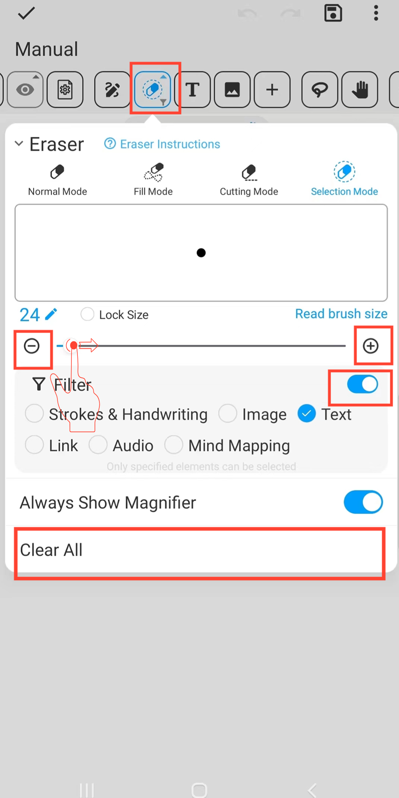

[Manuel de l'utilisateur](/dragonnest/drawnote/manual/fr) > [Super Note](/dragonnest/drawnote/manual/fr/super_note) >

Gomme
---
La fonction gomme offre plusieurs modes pour différents cas d'utilisation.
#### Étapes

Cliquez sur le bouton "Gomme" dans la barre d'outils.

- Mode normal - Utilise la technologie de masquage pour simuler de manière réaliste l'effet de gommage. Peut effacer différents éléments tels que des lignes, du texte et des images. Ce mode crée des marques d'effacement, permettant aux utilisateurs de sélectionner les éléments effacés.

- Mode de remplissage - Similaire au mode normal mais peut effacer rapidement une zone en forme de ventilateur.

- Mode de découpe - Divise les éléments en plusieurs parties indépendantes, uniquement applicable aux lignes et à certaines formes géométriques. Ce mode ne laisse aucune trace après l'effacement.

- Mode de Sélection - Supprime directement l'élément entier sélectionné et prend en charge le réglage des critères de filtre. Ce mode ne laisse aucune trace après l'effacement.

#### Conseils
- Cliquez sur "Tout effacer" pour vider l'ensemble du canevas.