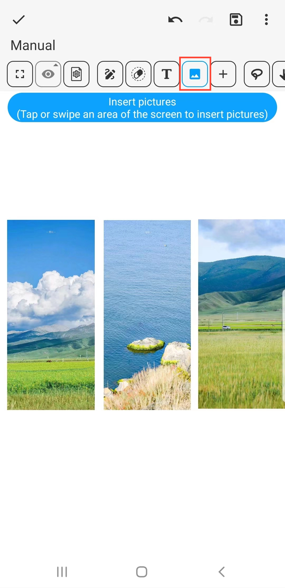
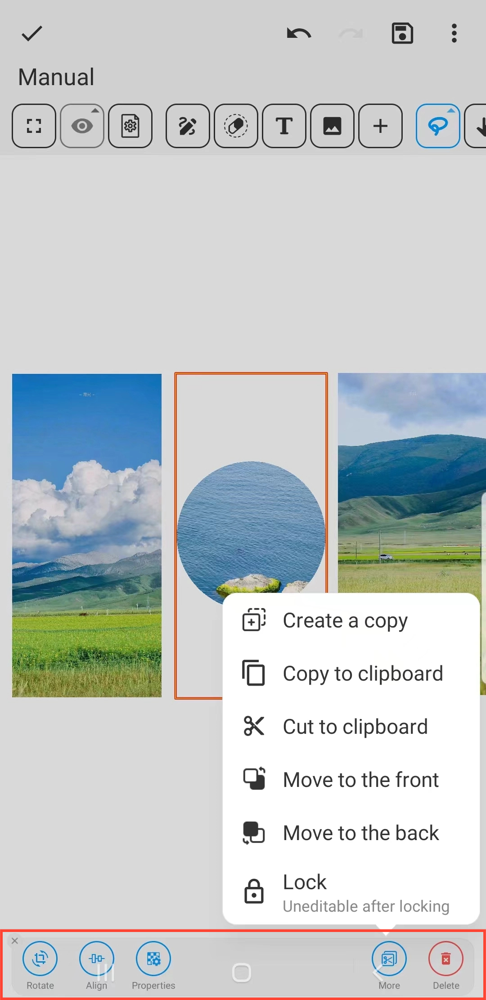

[Manuel de l'utilisateur](/dragonnest/drawnote/manual/fr) > [Super Note](/dragonnest/drawnote/manual/fr/super_note) >

Insérer une Images
---
#### Étapes

1. Cliquez sur le bouton "Images" dans la barre d'outils.

2. Touchez ou faites glisser une zone de l'écran pour insérer des images.

#### Conseils
- Après avoir sélectionné une image, la barre d'outils inférieure propose des options d'édition, telles que Rotation, Forme et Transparence.

- Vous pouvez combiner la fonction de texte pour annoter le contenu de l'image pour une expression plus détaillée et précise.

- Cliquez sur l'image pour la redimensionner.

