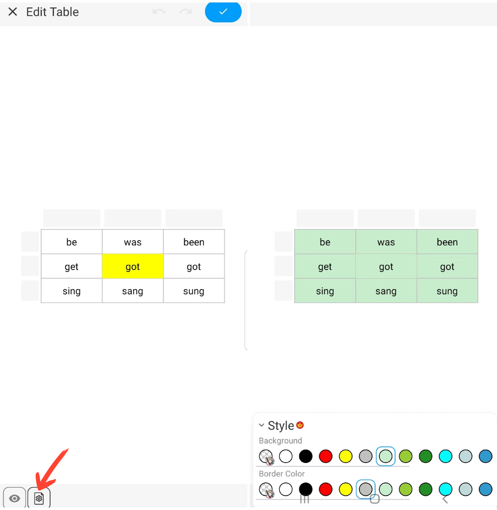

[Manuel de l'utilisateur](/dragonnest/drawnote/manual/fr) > [Super Note](/dragonnest/drawnote/manual/fr/super_note) >

Insérer un Tableau
---
#### Étapes

1. Cliquez sur le bouton "+" dans la barre d'outils.

2. Choisissez "Insérer un Tableau" pour ajouter un tableau à vos notes.

#### Conseils
- Définir le nombre de cellules - Faites glisser ou saisissez des chiffres pour choisir le nombre de cellules requis.

- Ajuster la largeur et la hauteur du tableau - Faites glisser le curseur de taille ou saisissez des chiffres pour définir la taille par défaut des cellules.

- Modifier le format de la cellule - Une fois une cellule sélectionnée, vous pouvez définir sa taille, sa couleur et effacer son contenu.

- Modifier le format de texte dans les cellules - Une fois une cellule sélectionnée, vous pouvez éditer son contenu textuel et son format, y compris la couleur, la taille de la police, le gras, le souligné et l'alignement.

- Définir le format pour une ligne ou une colonne entière - Une fois une ligne ou une colonne sélectionnée, vous pouvez fusionner des cellules, définir la couleur de fond, effacer le contenu, et plus encore.

- Insérer une ligne ou une colonne entière - Une fois une ligne ou une colonne sélectionnée, cliquez sur le bouton "Insérer" pour ajouter une nouvelle ligne ou colonne.

- Définir l'apparence du tableau - Cliquez sur le bouton "Paramètres" en bas à gauche du canevas, et dans le menu, définissez la couleur de fond et de bordure du tableau.

