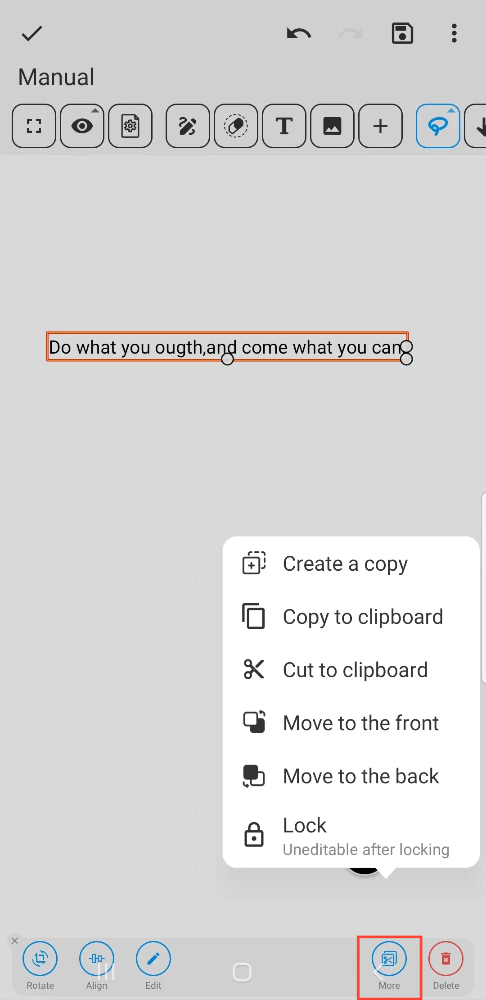
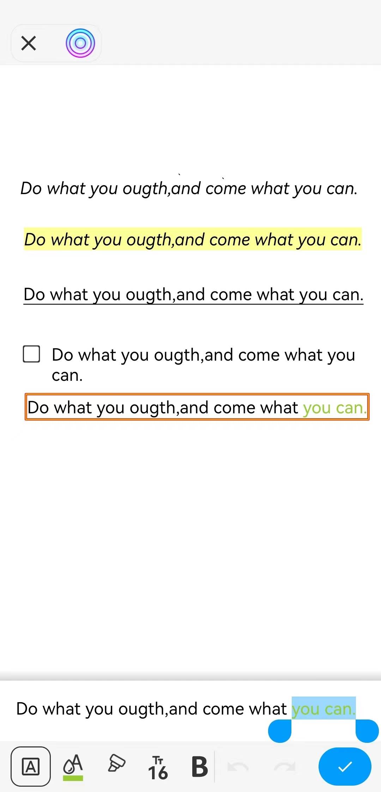

[Manuel de l'utilisateur](/dragonnest/drawnote/manual/fr) > [Super Note](/dragonnest/drawnote/manual/fr/super_note) >

Insérer du Texte
---
#### Étapes

1. Cliquez sur le bouton "T" dans la barre d'outils.

2. Touchez ou faites glisser une zone de l'écran pour insérer du texte.

#### Conseils
- Une fois la zone de texte sélectionnée, vous pouvez la faire pivoter, l'aligner, l'éditer, et plus encore. En cliquant sur "Plus", vous pouvez également créer une copie, couper vers le presse-papiers, et verrouiller et plus.

  

- Dans la boîte de modification de texte, une fois le texte sélectionné, vous pouvez définir son format, y compris la couleur, la taille, le gras, le souligné, et plus encore.

