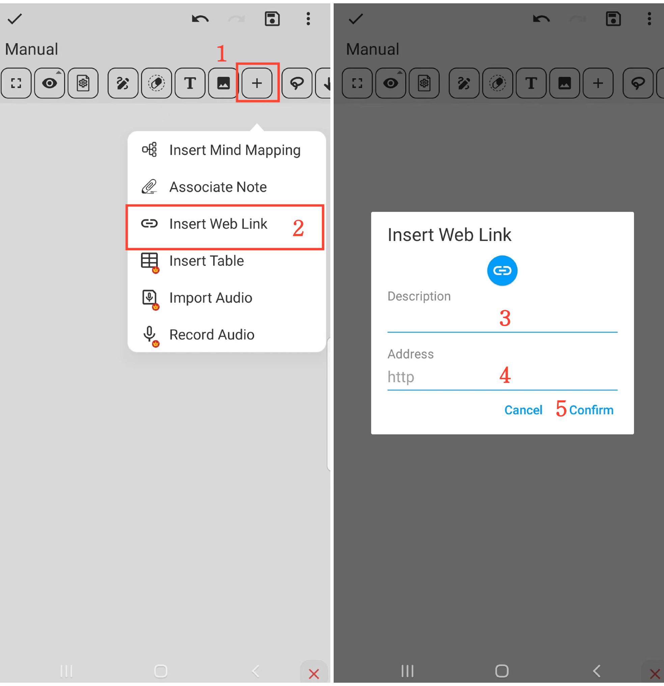

[Manuel de l'utilisateur](/dragonnest/drawnote/manual/fr) > [Super Note](/dragonnest/drawnote/manual/fr/super_note) >

Insérer un lien Web
---
#### Étapes

1. Cliquez sur le bouton "+" dans la barre d'outils.

2. Choisissez l'option "Insérer un lien Web".

3. Remplissez le nom du lien (facultatif).

4. Tapez ou collez le lien Web.

5. Confirmez l'opération pour insérer le lien.

#### Conseils
- Donnez un nom descriptif au lien pour le retrouver et le localiser plus facilement ultérieurement.

- En mode lecture, cliquez sur l'icône de lien pour accéder directement à la page Web.