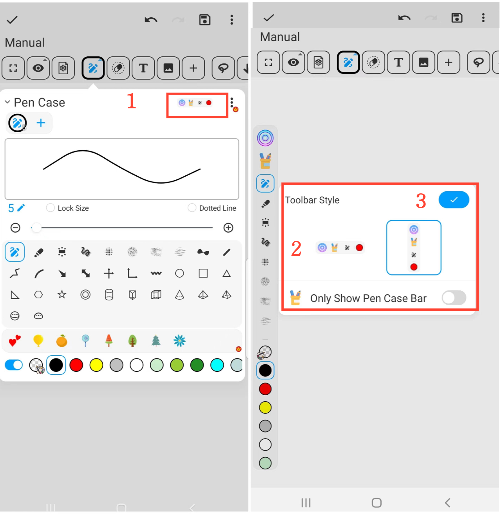

[Manuel de l'utilisateur](/dragonnest/drawnote/manual/fr) > [Super Note](/dragonnest/drawnote/manual/fr/super_note) >

Déplacer la barre d'outils du crayon
---

Vous pouvez ajuster la position horizontale ou verticale de la barre d'outils du crayon sur le canevas, permettant un déplacement facile de haut en bas ou de gauche à droite.

#### Étapes

1. Dans le boîtier du stylo, sélectionnez "Style de la barre d'outils".

2. Choisissez un alignement horizontal ou vertical.

3. Vérifiez pour confirmer.

#### Conseils
- Maintenez enfoncé le bouton circulaire sur la barre d'outils du crayon pour la faire glisser et ajuster sa position.

