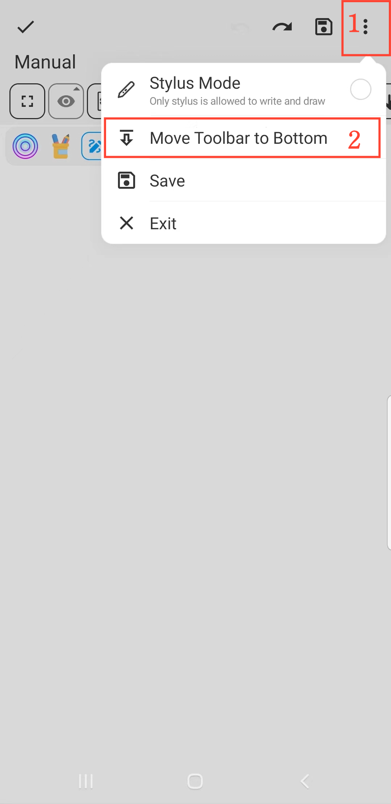

[Manuel de l'utilisateur](/dragonnest/drawnote/manual/fr) > [Super Note](/dragonnest/drawnote/manual/fr/super_note) >

Déplacer la barre d'outils
---
#### Étapes

1. Cliquez sur le bouton "⋮" dans le coin supérieur droit du canevas.

2. Choisissez la position de la barre d'outils : "Déplacer la barre d'outils en bas" ou "Déplacer la barre d'outils en haut".

