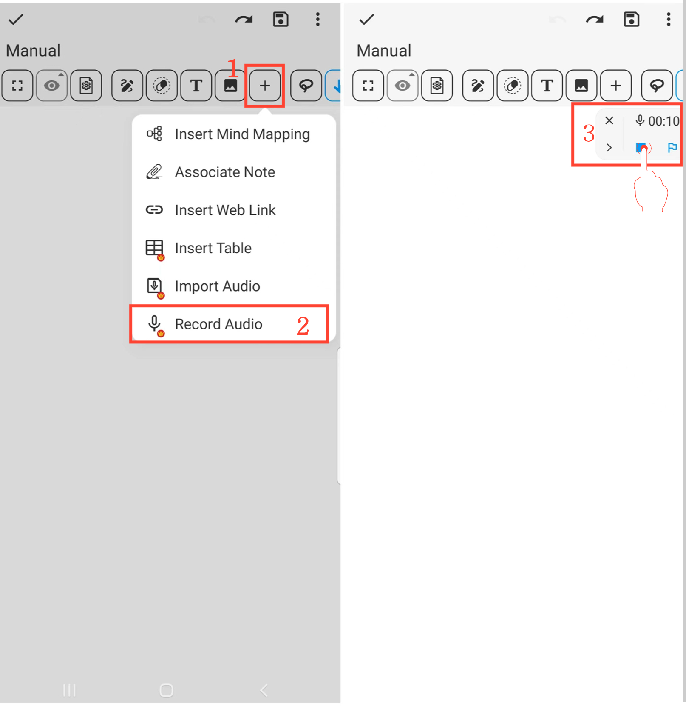

[Manuel de l'utilisateur](/dragonnest/drawnote/manual/fr) > [Super Note](/dragonnest/drawnote/manual/fr/super_note) >

Enregistrer un fichier audio
---
#### Étapes

1. Cliquez sur le bouton "+" dans la barre d'outils.

2. Sélectionnez l'option "Enregistrer un fichier audio" pour commencer l'enregistrement audio.

3. Cliquez sur le bouton "Arrêter" pour terminer l'enregistrement.

