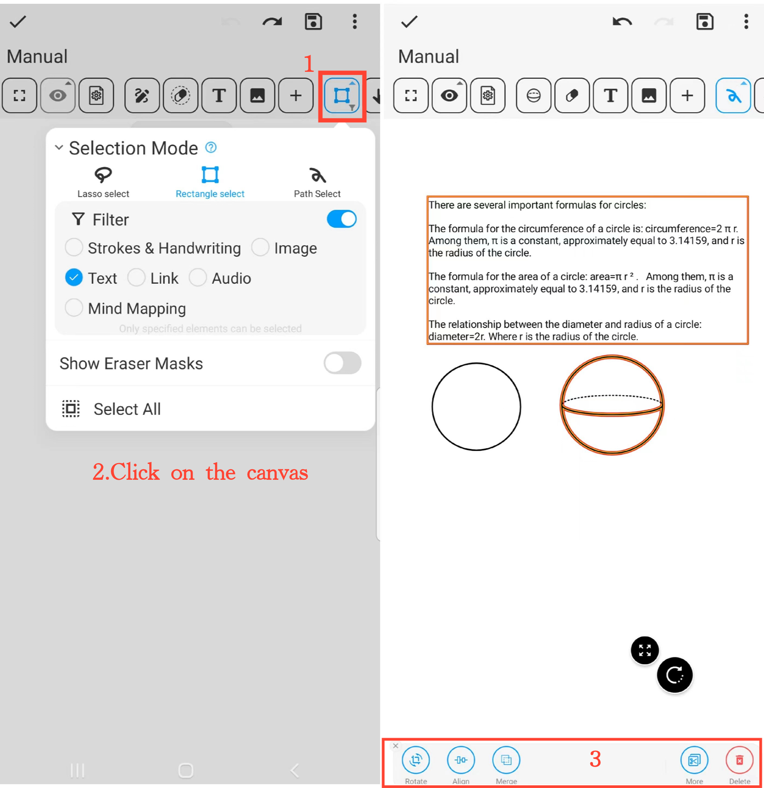

[Manuel de l'utilisateur](/dragonnest/drawnote/manuel/fr) > [Super Note](/dragonnest/drawnote/manuel/fr/super_note) >

Mode de sélection
---

Le mode de sélection propose divers outils de sélection :

- Sélection au lasso : Sélectionne les éléments à l'intérieur de la zone fermée formée par le lasso.

- Sélection rectangle : Sélectionne les éléments à l'intérieur de la zone rectangulaire.

- Sélection de chemin : Sélectionne les éléments couverts par le chemin.

#### Étapes

1. Cliquez sur le bouton "Mode de sélection" dans la barre d'outils et choisissez l'outil de sélection souhaité.

2. Cliquez sur le canevas et faites glisser pour sélectionner le contenu que vous souhaitez modifier, pouvant être un seul élément ou plusieurs éléments.

3. Effectuez des actions sur les éléments sélectionnés telles que la rotation, l'agrandissement, le rétrécissement, la fusion, la découpe, la suppression, et plus encore.

#### Conseils
Lorsque plusieurs éléments se chevauchent, vous pouvez activer le filtre pour sélectionner précisément un contenu spécifique, améliorant ainsi l'efficacité de la gestion et de l'organisation.