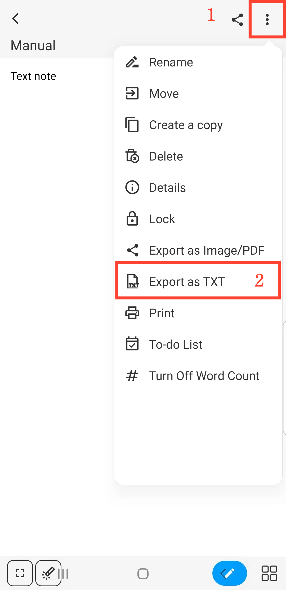

[Manuel de l'utilisateur](/dragonnest/drawnote/manual/fr) > [Note texte](/dragonnest/drawnote/manual/fr/text_note) >

Exporter en tant que fichier TXT
---
#### Étapes

En mode lecture de la Note texte, appuyez sur le bouton "⋮" situé en haut à droite de l'écran et sélectionnez "Exporter en tant que TXT".

