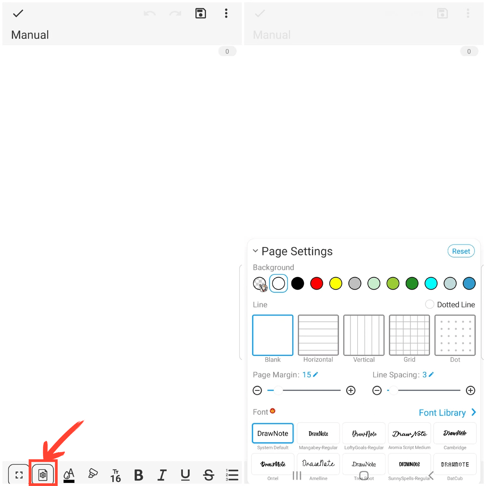

[Manuel de l'utilisateur](/dragonnest/drawnote/manual/fr) > [Note texte](/dragonnest/drawnote/manual/fr/text_note) >

Paramètres de la page
---
#### Étapes

Cliquez sur l'icône "Paramètres de la page" située dans la barre d'outils inférieure de l'écran pour ouvrir le menu des paramètres de la page. Vous pouvez définir l'arrière-plan de la page, le style de ligne, l'épaisseur de ligne, les marges de police, l'espacement des lignes et le style de police, entre autres.

