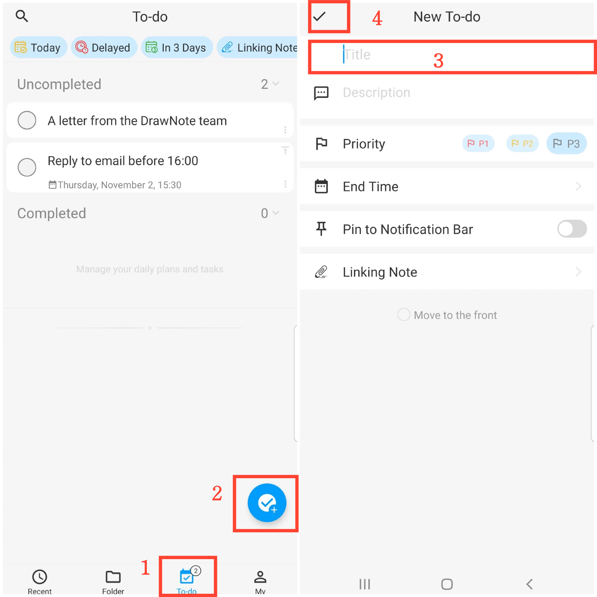

[Manuel de l'utilisateur](/dragonnest/drawnote/manual/fr) > [Liste de tâches](/dragonnest/drawnote/manual/en/to_do) >

Créer un nouvel élément de liste de tâches
---
#### Étapes

1. Accédez à la page 'tâches'.

2. Cliquez sur le bouton "+".

3. Entrez les détails tels que le titre, la description et autres informations pertinentes.

4. Appuyez sur le bouton de confirmation en haut à gauche pour ajouter un nouvel élément à la liste de tâches.

#### Conseils
1. Nombre de tâches à faire - Le nombre de tâches en attente est affiché sur la barre d'onglets inférieure.

2. Épingler un élément de liste de tâches - Sur la page 'Liste de tâches', appuyez sur le bouton "épingler" en haut à droite d'un élément pour déplacer les tâches importantes en haut.

3. Déplacer vers le haut - Dans l'écran 'Nouvelle liste de tâches', appuyez sur le bouton "Déplacer vers le haut" en bas pour positionner la tâche tout en haut.

