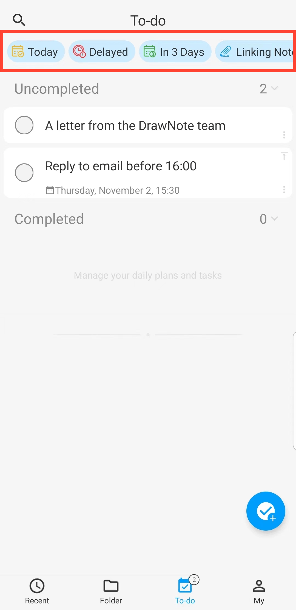

[Manuel de l'utilisateur](/dragonnest/drawnote/manual/fr) > [Liste de tâches](/dragonnest/drawnote/manual/fr/to_do) >

Filtre de tâches
---
Sur la page "tâches", vous pouvez filtrer les tâches en fonction du temps, de la priorité et des notes associées.

