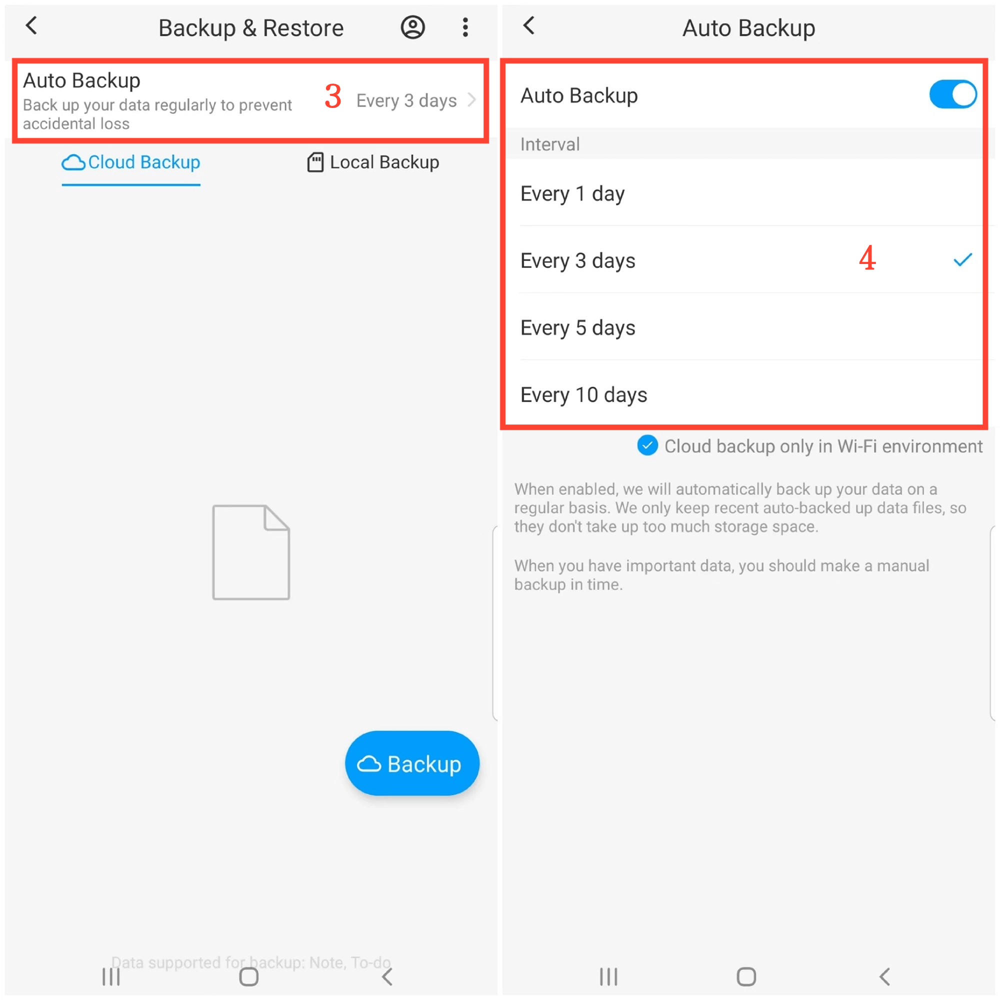

[Manuale Utente](/dragonnest/drawnote/manual/it) > [Backup e Ripristino Dati](/dragonnest/drawnote/manual/it/data_backup_and_recovery) >

Backup Automatico
---
#### Passaggi

1. Tocca "Io" nella pagina principale.

2. Vai all'opzione "Backup e Ripristino".

3. Seleziona l'opzione "Backup Automatico".

4. Attiva il pulsante "Backup Automatico" e scegli l'intervallo di backup. Per salvaguardare i tuoi dati e prepararti per circostanze impreviste.

