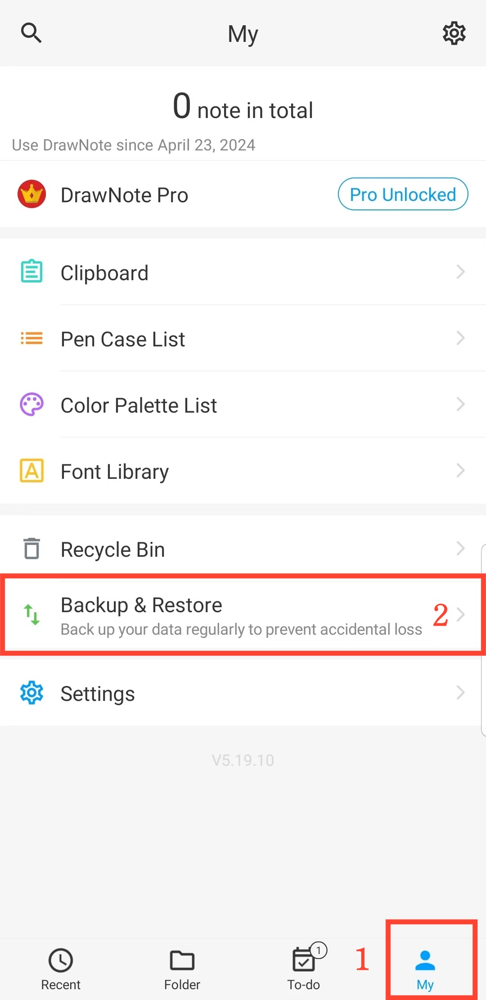

[Manuale utente](/dragonnest/drawnote/manual/it) >

Backup e Ripristino Dati
---

Con la funzione di backup e ripristino dati, puoi facilmente salvaguardare informazioni critiche ed evitare perdite impreviste.
Puoi scegliere tra "backup su cloud" o "backup locale".
- [Backup Dati](data_backup.md)

- [Backup Automatico](automatic_backup.md)

- [Ripristino Dati](data_recovery.md)

- [Gestione Dati di Backup](manage_backup_data.md)

