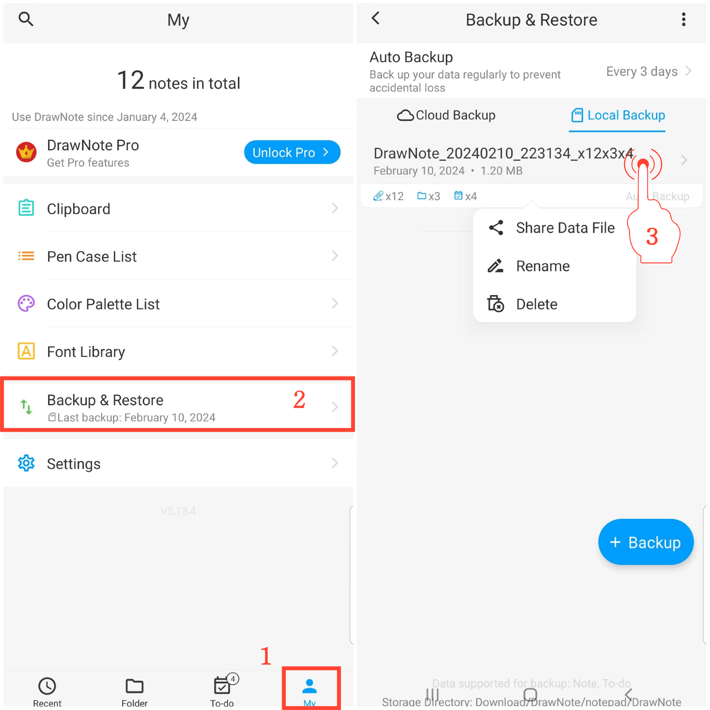

[Manuale Utente](/dragonnest/drawnote/manual/en) > [Backup e Ripristino Dati](/dragonnest/drawnote/manual/en/data_backup_and_recovery) >

Gestione Dati di Backup
---
#### Passaggi

1. Tocca "Io" nella pagina principale.

2. Accedi all'opzione "Backup & Ripristino".

3. Tieni premuta a lungo una voce di file per gestire gli elementi di ripristino dati. Puoi eseguire operazioni di condivisione, rinomina e cancellazione.

