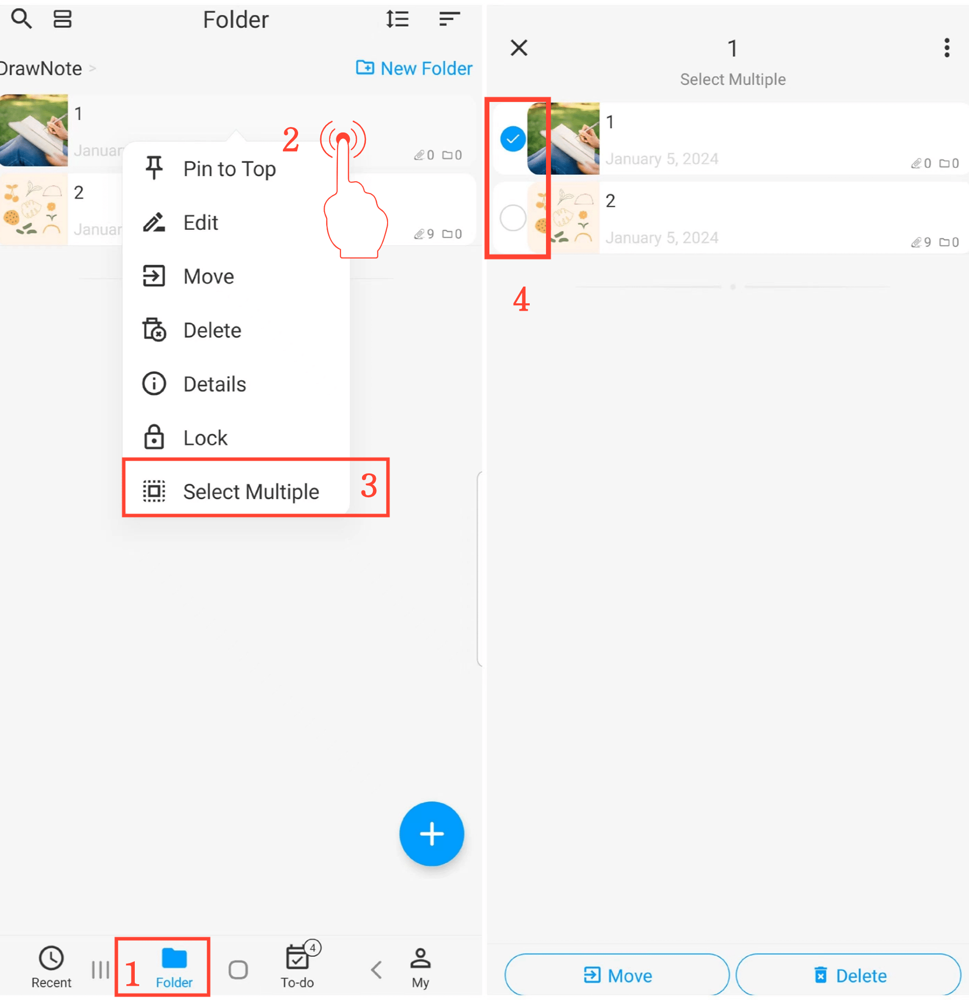

[Manuale Utente](/dragonnest/drawnote/manual/it) > [Cartella](/dragonnest/drawnote/manual/it/folder) >

Selezionare Più Cartelle o Appunti
---

#### Passaggi Operativi
1. Tocca "Cartella" nella pagina principale.
2. Tieni premuta a lungo una cartella o un appunto.
3. Tocca "Seleziona più elementi" nel menu a comparsa per entrare nella modalità di selezione multipla.
4. Seleziona le cartelle o gli appunti che desideri modificare, quindi esegui azioni di gruppo come spostare o eliminare.

