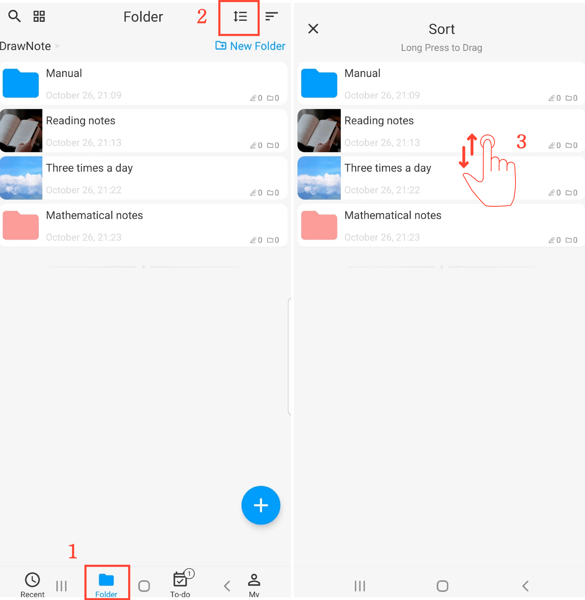

[Manuale Utente](/dragonnest/drawnote/manual/en) > [Cartella](/dragonnest/drawnote/manual/en/folder) >

Ordinare le Cartelle
---
Ci sono diversi modi per ordinare le cartelle. Puoi ordinarle per Nome, Data di modifica, Data di creazione e altro ancora, oppure puoi disporle manualmente.

#### Selezionare un Metodo di Ordinamento
Sulla pagina "Cartella", clicca sul pulsante "Ordina Per" e scegli il tuo metodo di ordinamento preferito.

#### Ordinamento Manuale
1. Sulla pagina "Cartella".

2. Clicca sul pulsante "Ordina".

3. Tieni premuto e trascina le cartelle su e giù per regolare il loro ordine.

