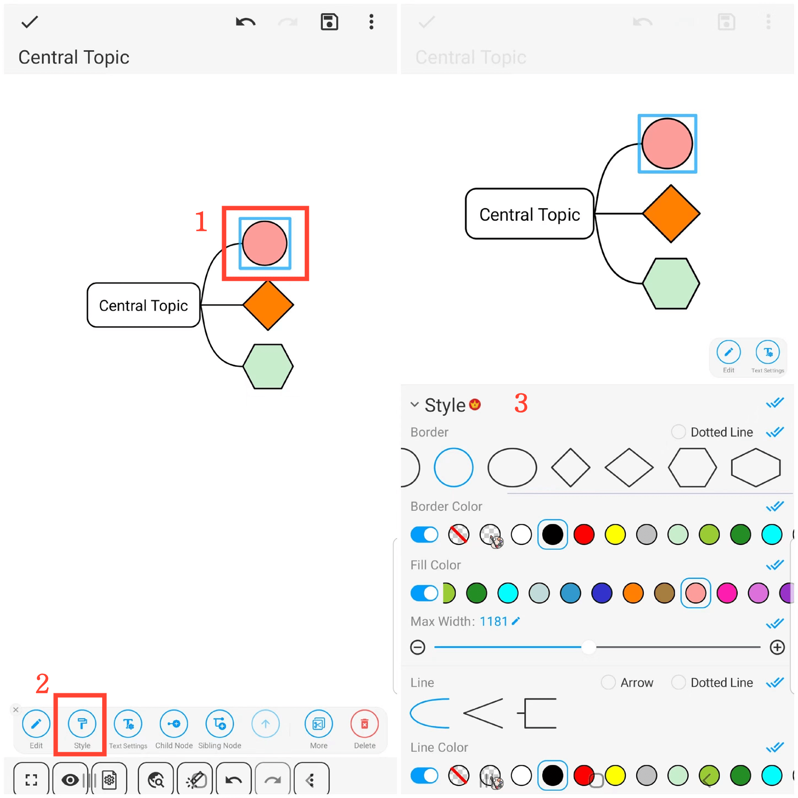
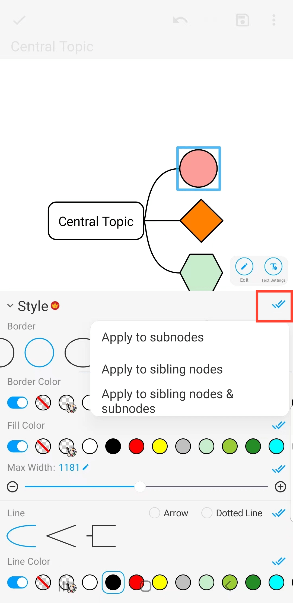

[User Manual](/dragonnest/drawnote/manual/it) > [Mind Mapping](/dragonnest/drawnote/manual/it/mind_mapping) >

Bordi e Stili delle Linee
---
#### Passaggi

1. Fare clic sul riquadro del nodo che si desidera impostare.

2. Fare clic sulla scheda "Stile".

3. Nella finestra di dialogo che appare, scegliere le opzioni di stile desiderate, come forma del bordo, colore del bordo, colore di riempimento, stile della linea e colore della linea.

#### Suggerimenti
Fare clic sulle doppie spunte blu a destra per applicare lo stile ai sotto-nodi, ai nodi fratelli o sia ai nodi fratelli che ai sotto-nodi.

