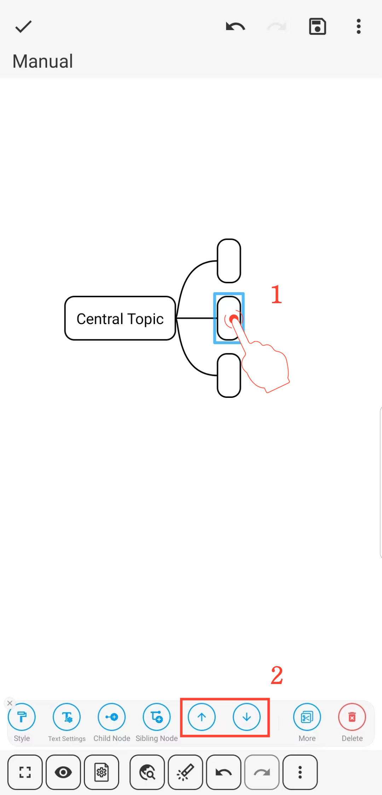

[User Manual](/dragonnest/drawnote/manual/en) > [Mind Mapping](/dragonnest/drawnote/manual/en/mind_mapping) >

Spostamento delle Posizioni dei Nodi
---

Ci sono due metodi per spostare le posizioni dei nodi:

- 1. Premi a lungo per muoverti - Selezionare il nodo, tenerlo premuto a lungo, trascinarlo nella nuova posizione e rilasciare per completare lo spostamento.

- 2. Spostamento con Pulsante - Fare clic sul nodo, selezionare il pulsante a freccia nel menu e completare lo spostamento della posizione del nodo.

